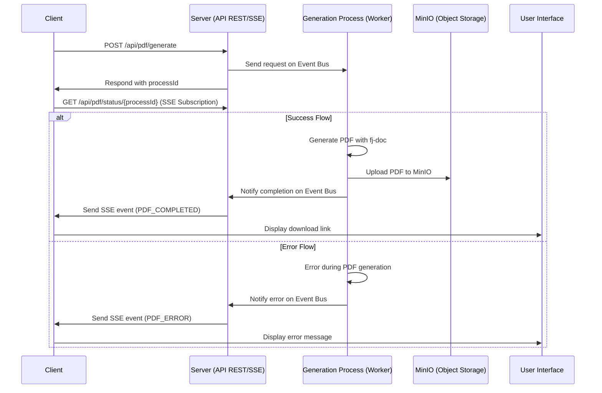

# Quarkus Server-Sent Event (SSE) Proof of Concept (PoC)

This project is a Proof of Concept (PoC) that demonstrates how to handle long-running asynchronous tasks in a Quarkus application, using Server-Sent Events (SSE) to notify the client in real-time.

The approach, based on SSE and reactive programming, offers a simpler alternative to WebSockets for unidirectional server-client communication, significantly improving the user experience in scenarios with long-running processes.

This project uses Quarkus, the Supersonic Subatomic Java Framework. For more information, please visit its official website: <https://quarkus.io/>.

## Prerequisites

To run the application and its supporting services locally, you will need the following tools:

-   Java Development Kit (JDK) 17 or higher
-   Apache Maven 3.8.x or higher
-   Docker and Docker Compose or Podman

## Architecture and Application Flow

The application's architecture is simple yet effective. The client sends a request to the server to start the PDF generation. The server responds with a unique ID for the request and begins the generation process in the background. During this process, the server sends status updates via SSE to the client.

The application flow can be summarized as follows:


*Figure 1: Application flow with Server-Sent Events*

The main components of this architecture are:

-   **Client**: Sends the PDF generation request and listens for updates.
-   **Server**: Manages the request, starts the generation process, and sends updates via SSE.
-   **Generation Process**: Executes the logic to generate the PDF in the background using the `fj-doc` library and saves the result to MinIO object storage.
-   **SSE**: Manages the communication of status updates from the server to the client.
-   **User Interface**: Displays the status of the PDF generation to the user.

## Bonus: A Framework for Document Generation

Unlike a simple simulation, this PoC does not just use a time delay but generates a real PDF document. For this task, **fj-doc** was chosen, an open-source framework for document generation in Java.

**fj-doc** ([https://github.com/fugerit-org/fj-doc](https://github.com/fugerit-org/fj-doc)), developed by [Matteo Franci](https://www.linkedin.com/in/matteo-franci/), is an extremely versatile library that simplifies the creation of documents in various formats, including PDF, HTML, XML, XLS/XLSX, and CSV.

One of its strengths is its flexibility: it allows defining the document structure through XML configuration files, separating business logic from presentation. Within this PoC, `fj-doc` is integrated into the `PdfEventProcessor` to create the PDF in a `ByteArrayOutputStream`, the result of which is then used for the upload to MinIO.

## Conclusions

This Proof of Concept (PoC) effectively demonstrates how to implement a robust and scalable system for managing asynchronous tasks in a Quarkus application. By leveraging Server-Sent Events (SSE), the Vert.x Event Bus, and asynchronous programming, we have built a complete flow that notifies a client in real-time without resorting to inefficient polling or the complexity of WebSockets.

The presented architecture is based on a clear **separation of responsibilities**:
- **`PdfResource`**: Manages the exposure of REST and SSE endpoints.
- **`SseBroadcaster`**: Centralizes the management of SSE connections.
- **`PdfEventProcessor`**: Orchestrates the heavy lifting in the background in a completely asynchronous manner.

However, the current `SseBroadcaster` based on an in-memory map represents a limitation for horizontal scaling. For a distributed production environment, the next step would be to replace this mechanism with an external messaging system (like Redis Pub/Sub, RabbitMQ, or Kafka).

## Running the application in dev mode

You can run your application in dev mode that enables live coding using:

```shell script
./mvnw quarkus:dev
```

> **_NOTE:_** Quarkus now ships with a Dev UI, which is available in dev mode only at <http://localhost:8080/q/dev/>.

## Testing the Application

Once the application is running, you can test the functionality by accessing the HTML SSE client at the following URL:

[http://localhost:8080/api/pdf/page](http://localhost:8080/api/pdf/page)

This page provides a simple interface to start the PDF generation process and observe the real-time status updates sent via Server-Sent Events.

## Packaging and running the application

The application can be packaged using:

```shell script
./mvnw package
```

It produces the `quarkus-run.jar` file in the `target/quarkus-app/` directory.
Be aware that it’s not an _über-jar_ as the dependencies are copied into the `target/quarkus-app/lib/` directory.

The application is now runnable using `java -jar target/quarkus-app/quarkus-run.jar`.

If you want to build an _über-jar_, execute the following command:

```shell script
./mvnw package -Dquarkus.package.jar.type=uber-jar
```

## Creating a native executable

You can create a native executable using:

```shell script
./mvnw package -Dnative
```

Or, if you don't have GraalVM installed, you can run the native executable build in a container using:

```shell script
./mvnw package -Dnative -Dquarkus.native.container-build=true
```

You can then execute your native executable with: `./target/quarkus-sse-poc-1.0.0-SNAPSHOT-runner`
