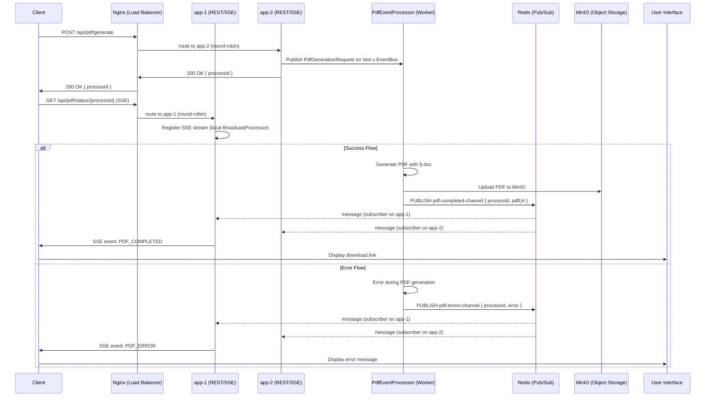

# Quarkus Server-Sent Event (SSE) Proof of Concept (PoC)

This project is a Proof of Concept (PoC) that demonstrates how to handle long-running asynchronous tasks in a Quarkus application, using Server-Sent Events (SSE) to notify the client in real-time.

The approach, based on SSE and reactive programming, offers a simpler alternative to WebSockets for unidirectional server-client communication, significantly improving the user experience in scenarios with long-running processes. The architecture has been evolved to support **horizontal scaling** via Redis Pub/Sub, so that any application instance can deliver events to any connected SSE client.

This project uses Quarkus, the Supersonic Subatomic Java Framework. For more information, please visit its official website: <https://quarkus.io/>.

## Prerequisites

To run the application and its supporting services locally, you will need the following tools:

-   Java Development Kit (JDK) 21 or higher
-   Apache Maven 3.8.x or higher
-   Podman (recommended) or Docker and Compose plugin

## Architecture and Application Flow

The application's architecture is designed for horizontal scaling. The client sends a request to any application instance to start the PDF generation. The server responds immediately with a unique process ID. A background worker generates the PDF, uploads it to MinIO and publishes a completion notification to a **Redis Pub/Sub channel**. Every application instance subscribes to this channel, so whichever instance holds the SSE connection for that process ID will deliver the event to the client - no sticky sessions required.


```mermaid
sequenceDiagram
    participant A as Client
    participant N as Nginx (Load Balancer)
    participant B1 as app-1 (REST/SSE)
    participant B2 as app-2 (REST/SSE)
    participant C as PdfEventProcessor (Worker)
    participant R as Redis (Pub/Sub)
    participant D as MinIO (Object Storage)
    participant E as User Interface

    A->>N: POST /api/pdf/generate
    N->>B2: route to app-2 (round-robin)
    B2->>C: Publish PdfGenerationRequest on Vert.x EventBus
    B2->>N: 200 OK { processId }
    N->>A: 200 OK { processId }

    A->>N: GET /api/pdf/status/{processId} (SSE)
    N->>B1: route to app-1 (round-robin)
    B1->>B1: Register SSE stream (local BroadcastProcessor)

    alt Success Flow
        C->>C: Generate PDF with fj-doc
        C->>D: Upload PDF to MinIO
        C->>R: PUBLISH pdf-completed-channel { processId, pdfUrl }
        R-->>B1: message (subscriber on app-1)
        R-->>B2: message (subscriber on app-2)
        B1->>A: SSE event: PDF_COMPLETED
        A->>E: Display download link
    else Error Flow
        C->>C: Error during PDF generation
        C->>R: PUBLISH pdf-errors-channel { processId, error }
        R-->>B1: message (subscriber on app-1)
        R-->>B2: message (subscriber on app-2)
        B1->>A: SSE event: PDF_ERROR
        A->>E: Display error message
    end
```
*Figure 1: Distributed application flow with Redis Pub/Sub and Server-Sent Events*

The main components of this architecture are:

-   **Client**: Sends the PDF generation request and listens for updates via SSE.
-   **Nginx**: Acts as reverse proxy and round-robin load balancer; SSE-specific settings (`proxy_buffering off`, long `proxy_read_timeout`) are pre-configured.
-   **PdfResource**: Exposes the REST and SSE endpoints on each application instance.
-   **SseBroadcaster**: Subscribes to Redis channels at startup; delivers events to locally connected SSE clients. Implements a **pending-event buffer** (Redis `SETEX`/`GETDEL`) to handle race conditions where Redis publishes before the SSE client connects.
-   **PdfEventProcessor**: Executes PDF generation in a background thread pool using `fj-doc`, uploads the result to MinIO, and publishes the outcome to Redis Pub/Sub.
-   **Redis**: Cross-instance Pub/Sub transport. Also stores pending events (TTL = 300 s) for late-arriving SSE clients.
-   **MinIO**: S3-compatible object storage for generated PDF files.

## Bonus: A Framework for Document Generation

Unlike a simple simulation, this PoC does not just use a time delay but generates a real PDF document. For this task, **fj-doc** was chosen, an open-source framework for document generation in Java.

**fj-doc** ([https://github.com/fugerit-org/fj-doc](https://github.com/fugerit-org/fj-doc)), developed by [Matteo Franci](https://www.linkedin.com/in/matteo-franci/), is an extremely versatile library that simplifies the creation of documents in various formats, including PDF, HTML, XML, XLS/XLSX, and CSV.

One of its strengths is its flexibility: it allows defining the document structure through XML configuration files, separating business logic from presentation. Within this PoC, `fj-doc` is integrated into the `PdfEventProcessor` to create the PDF in a `ByteArrayOutputStream`, the result of which is then used for the upload to MinIO.

## Conclusions

This Proof of Concept (PoC) effectively demonstrates how to implement a robust and horizontally scalable system for managing asynchronous tasks in a Quarkus application. By leveraging Server-Sent Events (SSE), Redis Pub/Sub, the Vert.x Event Bus, and asynchronous programming, we have built a complete distributed flow that notifies a client in real-time — regardless of which application instance processed the request.

The architecture is based on a clear **separation of responsibilities**:
- **`PdfResource`**: Manages the exposure of REST and SSE endpoints.
- **`SseBroadcaster`**: Subscribes to Redis Pub/Sub channels; delivers events to locally connected SSE clients; buffers events in Redis for late-arriving connections.
- **`PdfEventProcessor`**: Orchestrates the heavy lifting in the background in a completely asynchronous manner; publishes results to Redis Pub/Sub.

The pending-event buffer (Redis `SETEX`/`GETDEL` with TTL = 300 s) solves the race condition where a Redis message arrives before the SSE client opens its stream, ensuring exactly-once delivery even in a distributed environment.

## Running the application in dev mode

You can run your application in dev mode that enables live coding using:

```shell script
./mvnw quarkus:dev
```

> **_NOTE:_** Quarkus Dev Services automatically starts Redis and MinIO containers in dev/test mode — no manual configuration is needed.

> **_NOTE:_** Quarkus now ships with a Dev UI, which is available in dev mode only at <http://localhost:8080/q/dev/>.

## Testing the Application

Once the application is running, you can test the functionality by accessing the HTML SSE client at the following URL:

[http://localhost:8080/api/pdf/page](http://localhost:8080/api/pdf/page)

This page provides a simple interface to start the PDF generation process and observe the real-time status updates sent via Server-Sent Events.

## Deployment with Podman Compose

A ready-to-use `docker-compose.yml` is provided in `src/main/docker/` and is fully compatible with **Podman Compose** (≥ 1.0) and the built-in `podman compose` command (Podman ≥ 4.7). The stack includes:

| Service | Image | Role |
|---------|-------|------|
| `redis` | `registry.redhat.io/rhel9/redis-7:9.8-1782346713` | Cross-instance Pub/Sub transport (RHEL 9) |
| `minio` | `minio/minio:latest` | Object storage for generated PDFs |
| `minio-init` | `minio/mc:latest` | One-shot bucket initialiser |
| `app-1` | `quarkus/quarkus-sse-poc-jvm:latest` | Quarkus instance 1 |
| `app-2` | `quarkus/quarkus-sse-poc-jvm:latest` | Quarkus instance 2 |
| `nginx` | `nginx:1.27-alpine` | Reverse proxy / load balancer |

### Quick start (macOS with Podman)

```shell script
# 1. (First time only) Initialise and start the Podman Machine
podman machine init
podman machine start

# 2. Login to Red Hat Registry (required for Redis image)
podman login registry.redhat.io
# Use your Red Hat account credentials

# 3. Build the application JAR
./mvnw package -DskipTests

# 4. Build the container image
podman build -f src/main/docker/Dockerfile.jvm \
             -t quarkus/quarkus-sse-poc-jvm:latest .

# 5. Start the full stack
podman compose -f src/main/docker/docker-compose.yml up -d

# Application → http://localhost:8080
# MinIO UI    → http://localhost:8080/minio-console/
# MinIO API   → http://localhost:9000
```

> **Red Hat Registry Authentication**: The Redis image is hosted on Red Hat's registry and requires authentication. You can use a free [Red Hat Developer account](https://developers.redhat.com/register) or your Red Hat subscription credentials.

> **Redis Protected Mode**: The RHEL Redis image runs in protected mode by default. For local development, the `docker-compose.yml` disables it with `--protected-mode no` since Redis is only accessible within the Docker backend network. For production deployments, see `src/docs/REDIS_PROTECTED_MODE.md` for secure authentication configurations.

> **Rootless Podman note**: The default `NGINX_HTTP_PORT` is `8080` (set in `src/main/docker/.env`) to avoid the port < 1024 restriction of rootless containers.

## Packaging and running the application

The application can be packaged using:

```shell script
./mvnw package
```

It produces the `quarkus-run.jar` file in the `target/quarkus-app/` directory.
Be aware that it's not an _über-jar_ as the dependencies are copied into the `target/quarkus-app/lib/` directory.

The application is now runnable using `java -jar target/quarkus-app/quarkus-run.jar`.

If you want to build an _über-jar_, execute the following command:

```shell script
./mvnw package -Dquarkus.package.jar.type=uber-jar
```

## Creating a native executable

You can create a native executable using:

```shell script
./mvnw package -Dnative
```

Or, if you don't have GraalVM installed, you can run the native executable build in a container using:

```shell script
./mvnw package -Dnative -Dquarkus.native.container-build=true
```

You can then execute your native executable with: `./target/quarkus-sse-poc-1.0.0-SNAPSHOT-runner`
