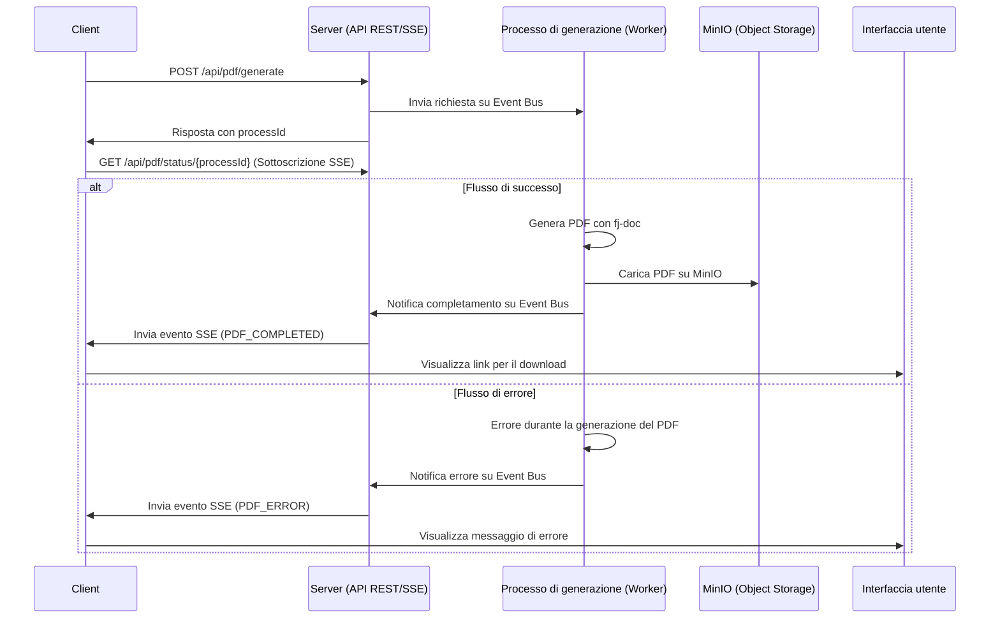

## Cronologia delle revisioni

| Versione | Data       | Autore          | Descrizione delle Modifiche                                                             |
|:---------|:-----------|:----------------|:----------------------------------------------------------------------------------------|
| 1.0.0    | 2025-06-21 | Antonio Musarra | Prima release                                                                           |
| 1.1.0    | 2025-06-22 | Antonio Musarra | Aggiunti i capitoli bonus, immagini e didascalie                                        |
| 1.2.0    | 2025-06-23 | Antonio Musarra | Aggiornamento per riflettere l'uso di MinIO, fj-doc e il nuovo formato degli eventi SSE |

[TOC]

<div style="page-break-after: always; break-after: page;"></div>

## Introduzione

La gestione di task asincroni in un'applicazione web può essere una sfida, specialmente quando si tratta di operazioni che richiedono molto tempo, come la generazione di report o l'elaborazione di file. Una soluzione efficace per notificare lo stato di tali operazioni ai client è l'uso dei **Server-Sent Events (SSE)**. Questi eventi consentono al server di inviare aggiornamenti in tempo reale a un client, migliorando l'esperienza utente e la reattività dell'applicazione.

In questa **serie di due articoli**, analizzeremo un'applicazione Proof of Concept (PoC) che dimostra come utilizzare i Server-Sent Events (SSE) per notificare a un client lo stato di un processo asincrono di lunga durata, come la generazione di un PDF.

**In questa prima puntata** esploreremo l'architettura complessiva, il funzionamento degli endpoint REST e SSE, e la gestione delle sottoscrizioni e degli aggiornamenti di stato. **Nella seconda puntata** approfondiremo il servizio di generazione del PDF, i test dell'applicazione e le considerazioni per un ambiente di produzione.

A differenza di una semplice simulazione, questa PoC genera realmente un file PDF utilizzando la libreria **fj-doc** e lo archivia su uno storage a oggetti **MinIO**.

> **Bonus**: alla fine della seconda puntata, troverai il link al progetto completo su GitHub, che include un'applicazione Quarkus funzionante con SSE e un client HTML per testare la funzionalità. Inoltre, sono inclusi test automatici con JUnit per garantire la qualità del codice e la corretta integrazione tra i componenti + una collection di Postman per testare il flusso end-to-end.

## Cosa sono i Server-Sent Events (SSE)?

I Server-Sent Events sono uno standard web che permette a un server di inviare aggiornamenti a un client in modo pro-attivo su una singola connessione HTTP. A differenza di WebSockets, la comunicazione è unidirezionale: solo dal server al client. Quali sono i vantaggi principali dei SSE?

- **Semplicità**: SSE si basa su HTTP/1.1 ed è più semplice da implementare sia lato client che server rispetto a WebSockets.
- **Efficienza**: evita overhead del polling continuo, dove il client deve chiedere ripetutamente al server se ci sono novità.
- **Standard Web**: è supportato nativamente dalla maggior parte dei browser moderni tramite l'oggetto EventSource.
- **Reconnect Automatica**: i client SSE gestiscono automaticamente la reconnect in caso di perdita del collegamento.

In questa PoC, SSE viene utilizzato per informare l'utente sullo stato di una richiesta di generazione di un PDF.

Il client avvia la richiesta, riceve un ID e si mette in ascolto su un canale SSE in attesa di ricevere la notifica di avvenuta generazione del PDF. Questo approccio consente di mantenere l'interfaccia utente reattiva e di evitare il blocco del thread principale durante operazioni potenzialmente lunghe.

<div style="page-break-after: always; break-after: page;"></div>

## Architettura e flusso dell'applicazione

L'architettura dell'applicazione è semplice ma efficace. Il client invia una richiesta al server per avviare la generazione del PDF. Il server risponde con un ID univoco per la richiesta e inizia il processo di generazione in background. Durante questo processo, il server invia aggiornamenti di stato tramite SSE al client, che poi deciderà come usare queste informazioni.

Il flusso dell'applicazione può essere riassunto come segue:



**Figura 1**: Flusso dell'applicazione con Server-Sent Events

Quali sono i componenti principali di questa architettura?

- **Client**: invia la richiesta di generazione del PDF e si mette in ascolto per gli aggiornamenti.
- **Server**: gestisce la richiesta, avvia il processo di generazione e invia gli aggiornamenti tramite SSE.
- **Processo di generazione**: esegue la logica per generare il PDF in background utilizzando la libreria `fj-doc` e salvando il risultato su uno storage a oggetti MinIO.
- **SSE**: gestisce la comunicazione degli aggiornamenti di stato dal server al client.
- **Interfaccia utente**: mostra lo stato della generazione del PDF all'utente.

<div style="page-break-after: always; break-after: page;"></div>

Questa architettura consente di separare le responsabilità, mantenendo il codice pulito e facilmente manutenibile. Il server gestisce la logica di business, mentre il client si occupa della presentazione e dell'interazione con l'utente.

Questa PoC è stata realizzata utilizzando il framework cloud native Quarkus. Quali sono i componenti principali di Quarkus utilizzati in questa PoC?

- **Quarkus REST**: per gestire le richieste HTTP e le risposte usando il modello non bloccante e il supporto per SSE.
- **Quarkus Event Bus**: per gestire la comunicazione asincrona tra i vari componenti dell'applicazione.
- **Quarkus Mutiny**: per gestire la programmazione reattiva e le operazioni asincrone in modo semplice e intuitivo.
- **Quarkus MinIO Client**: per interagire con lo storage a oggetti MinIO e gestire il caricamento dei file PDF generati.

<div style="page-break-after: always; break-after: page;"></div>

## Analisi del codice sorgente

Il backend dell'applicazione è costituito da due componenti principali:

1. Endpoint REST per avviare la generazione del PDF e restituire l'ID della richiesta.
2. Endpoint SSE per inviare aggiornamenti di stato al client.
3. Un componente che gestisce gli eventi SSE e le notifiche di completamento o errore della generazione del PDF.
4. Un componente che gestisce la logica di generazione del PDF e invia gli aggiornamenti di stato usando l'Event Bus di Quarkus.

### Endpoint REST

L'endpoint REST `/generate` è responsabile dell'avvio della generazione del PDF e della restituzione dell'ID della richiesta. A seguire l'implementazione di questo endpoint.

```java
@POST
@Path("/generate")
@Produces(MediaType.TEXT_PLAIN)
public Uni<String> generatePdf() {
    String processId = UUID.randomUUID().toString();
    Log.debugf("Starting the PDF generation for ID: %s", processId);

    // Pubblica una richiesta sull'event bus
    eventBus.publish(
        requestsDestination,
        new PdfGenerationRequest(processId),
        new DeliveryOptions().setCodecName(PdfGenerationRequestCodec.CODEC_NAME));

    Log.debugf("Request for PDF generation for ID %s sent to the event bus.", processId);

    return Uni.createFrom().item(processId);
}
```

**Source Code 1**: Implementazione dell'endpoint REST per la richiesta di generazione del PDF

Questo è un tipo di operazione non bloccante che restituisce un `Uni<String>`, per essere eseguita sul thread di I/O (event loop), garantendo così prestazioni elevate e scalabilità. Il metodo genera un ID univoco per la richiesta e pubblica un evento sull'Event Bus di Quarkus per avviare il processo di generazione del PDF.

L'endpoint `/download/{processId}` permette di scaricare il PDF generato dal servizio di storage S3 MinIO.
Quest'operazione è anch'essa non bloccante e restituisce un `Uni<Response>`, che rappresenta la risposta HTTP con il file PDF come contenuto. La logica bloccante per il download del PDF da MinIO viene eseguita all'interno di un blocco `Uni.createFrom().item(() -> {...})`, per garantire che non blocchi il thread di I/O.

<div style="page-break-after: always; break-after: page;"></div>

```java
@GET
@Path("/download/{processId}")
@Produces(MediaType.APPLICATION_OCTET_STREAM)
public Uni<Response> downloadPdf(@PathParam("processId") String processId) {
    return Uni.createFrom().item(() -> {
        String objectKey = processId + ".pdf";
        try {
            InputStream stream = minioClient.getObject(
                    GetObjectArgs.builder()
                            .bucket(bucketName)
                            .object(objectKey)
                            .build());

            Response.ResponseBuilder response = Response.ok(stream);
            response.header(HttpHeaders.CONTENT_DISPOSITION, "attachment;filename=" + objectKey);
            response.header(HttpHeaders.CONTENT_TYPE, MediaType.APPLICATION_OCTET_STREAM);
            return response.build();
        } catch (ErrorResponseException e) {
            if ("NoSuchKey".equals(e.errorResponse().code())) {
                Log.warnf("PDF with key: %s not found in MinIO bucket: %s", objectKey, bucketName);
                return Response.status(Response.Status.NOT_FOUND).build();
            }
            Log.errorf(e, "Failed to download PDF with key: %s from MinIO bucket: %s", objectKey, bucketName);
            return Response.serverError().entity(e.getMessage()).build();
        } catch (Exception e) {
            Log.errorf(e, "An unexpected error occurred while downloading PDF with key: %s", objectKey);
            return Response.serverError().entity(e.getMessage()).build();
        }
    });
}
```

**Source Code 2**: Implementazione dell'endpoint REST per il download del PDF

> **Approfondimento**: per saperne di più su Quarkus e il suo Event Bus, consulta la [documentazione ufficiale](https://quarkus.io/guides/reactive-event-bus).
> Per ulteriori approfondimenti sull'Event Bus, consiglio di leggere l'eBook [Quarkus Event Bus - Come sfruttarlo al massimo: utilizzi e vantaggi](https://bit.ly/3VTG2dt).

<div style="page-break-after: always; break-after: page;"></div>

### Endpoint SSE

L'endpoint SSE `/status/{id}` e di conseguenza il metodo `getPdfStatus`, è il cuore del meccanismo di notifica tramite Server-Sent Events (SSE). A seguire l'implementazione di questo endpoint.

```java
@GET
@Path("/status/{processId}")
@Produces(MediaType.SERVER_SENT_EVENTS)
public Multi<OutboundSseEvent> getPdfStatus(@PathParam("processId") String processId) {
   Log.debugf("The client requested status for ID: %s", processId);
   return sseBroadcaster.createStream(processId);
}
```

**Source Code 3**: Implementazione dell'endpoint SSE per gli aggiornamenti di stato del PDF

Lo scopo di questo metodo è di stabilire una connessione persistente tra il client (ad esempio, un browser) e il server. Attraverso questa connessione, il server può inviare aggiornamenti di stato (eventi) al client in modo proattivo, senza che il client debba continuamente interrogare il server (polling).

L'annotazione `@Produces(MediaType.SERVER_SENT_EVENTS)` indica che questo endpoint produrrà eventi SSE, che saranno inviati al client in formato `text/event-stream`, che è lo standard per le comunicazioni SSE. Dice a Quarkus e al client di trattare questa connessione come un flusso di eventi.

Il tipo di ritorno `Multi<OutboundSseEvent>` rappresenta un flusso di eventi (di zero o più elementi) che possono essere inviati al client.`Multi` è una parte del framework Mutiny di Quarkus, che consente di gestire flussi reattivi in modo semplice e intuitivo. In questo contesto, ogni `OutboundSseEvent` emesso dal `Multi` verrà inviato come un singolo evento SSE al client.

Il metodo `sseBroadcaster.createStream(processId)` crea un flusso di eventi SSE associato all'ID del processo specificato utilizzando il componente `SseBroadcaster` responsabile di:

1. Registrare l'interesse del client per quel `processId`.
2. Restituire un `Multi` a cui il client si "sottoscrive".
3. Quando un evento (come `PdfGenerationCompleted`) per quel `processId` viene ricevuto da un'altra parte dell'applicazione (ad esempio, dal worker), il `SseBroadcaster` lo invierà (`emit`) sul `Multi` appropriato, facendolo arrivare al client connesso.

In sintesi, quando un client chiama `GET /api/pdf/status/{processId}`, questo metodo apre un canale di comunicazione SSE e lo "sintonizza" per ricevere solo gli eventi relativi a quel `processId`, delegando tutta la gestione del flusso all'oggetto `SseBroadcaster`.

<div style="page-break-after: always; break-after: page;"></div>

#### Nota sulla Gestione delle Connessioni SSE con SseBroadcaster

Nell'implementazione corrente, la gestione delle connessioni Server-Sent Events (SSE) è stata centralizzata nel componente `SseBroadcaster`. Questo servizio astrae la logica di creazione, memorizzazione e notifica dei flussi di eventi, semplificando il codice dell'endpoint `PdfResource`.

L'implementazione sottostante del `SseBroadcaster` si basa su un meccanismo **in-memory** (come una `ConcurrentMap`) locale alla singola istanza della JVM.

Questo approccio, sebbene efficace per una singola istanza, presenta limiti significativi in un ambiente di produzione distribuito (es. cluster Kubernetes, più istanze dietro un load balancer):

- **Stato Locale**: la mappa degli emitter risiede nella memoria di una singola istanza. Se l'applicazione viene scalata orizzontalmente, ogni istanza avrà il proprio `SseBroadcaster` con una mappa isolata e non condivisa.
- **Problema di Routing**: un client potrebbe stabilire la connessione SSE con l'istanza A, ma l'evento di completamento del PDF potrebbe essere gestito dall'istanza B. L'istanza B non avrebbe alcun riferimento all'emitter del client (che si trova sull'istanza A) e non potrebbe inviare la notifica.
- **Mancanza di Resilienza**: se l'istanza che detiene la connessione si riavvia o va in crash, tutte le connessioni attive e i relativi emitter vengono persi.

Per superare questi limiti, il meccanismo di broadcast in-memory dovrebbe essere sostituito da un sistema di messaggistica **Publish/Subscribe esterno**, come Redis Pub/Sub, RabbitMQ o Apache Kafka.

Il flusso modificato sarebbe:

1. Quando un client si connette, il `SseBroadcaster` dell'istanza corrente crea l'emitter e sottoscrive un canale/topic univoco sul message broker (es. `pdf-status-channel:<processId>`).
2. Quando un worker (su qualsiasi istanza) completa la generazione del PDF, pubblica un messaggio su quel canale specifico nel broker.
3. Il broker distribuisce il messaggio a tutti i sottoscrittori. L'istanza che ha la connessione SSE attiva riceve il messaggio.
4. A questo punto, il `SseBroadcaster` di quell'istanza riceve il messaggio dal broker e invia la notifica al client tramite l'emitter corretto.

Questo pattern rende le istanze dell'applicazione stateless rispetto alla gestione delle sessioni SSE, permettendo di scalare orizzontalmente in modo affidabile.

<div style="page-break-after: always; break-after: page;"></div>

### Gestione della sottoscrizione e degli aggiornamenti di stato

La responsabilità di ascoltare gli eventi dall'Event Bus e di inviare le notifiche SSE ai client è stata assegnata un componente dedicato: `SseBroadcaster`. Questo migliora la separazione delle responsabilità e rende il codice più pulito e facile da manutenere.

Il `SseBroadcaster` si inizializza all'avvio dell'applicazione, sottoscrivendo i consumer per gli eventi di completamento e di errore.

```java
@ApplicationScoped
public class SseBroadcaster {

   // ... (campi e costruttore)

   void onStart(@Observes StartupEvent ev) {
      Log.debug("SseBroadcaster is initializing...");
      eventBus.<PdfGenerationCompleted>consumer(completedDestination)
              .handler(this::handleCompletionEvent);
      eventBus.<PdfGenerationError>consumer(errorsDestination)
              .handler(this::handleErrorEvent);
      Log.debug("SseBroadcaster initialized and listening for completion and error events.");
   }

   private void handleCompletionEvent(Message<PdfGenerationCompleted> message) {
      PdfGenerationCompleted event = message.body();
      String processId = event.processId();
      BroadcastProcessor<OutboundSseEvent> processor = processors.get(processId);

      if (processor != null) {
         OutboundSseEvent sseEvent = sse.newEventBuilder()
                 .name("PDF_COMPLETED")
                 .data(event)
                 .mediaType(MediaType.APPLICATION_JSON_TYPE)
                 .build();
         processor.onNext(sseEvent);
         processor.onComplete();
         processors.remove(processId);
      } else {
         Log.warnf("No active SSE processor found for processId: %s", processId);
      }
   }

   // ... (metodo handleErrorEvent e altri)
}
```

**Source Code 4**: Gestione centralizzata degli eventi nel SseBroadcaster

Ogni qualvolta viene ricevuto un evento di completamento della generazione del PDF, il metodo `handlePdfCompletedEvent` viene chiamato per inviare l'aggiornamento di stato al client tramite l'emitter associato all'ID del processo. Lo stesso vale per gli eventi di errore, gestiti dal metodo `handlePdfErrorEvent`.

Come funziona:

1. Inizializzazione (`@Observes StartupEvent`): all'avvio dell'applicazione, Quarkus invoca il metodo `onStart`. Questo metodo registra i consumer per due destinazioni sull'Event Bus: una per gli eventi di successo (`completedDestination`) e una per gli errori (`errorsDestination`).
2. Gestione Eventi:
   - Quando il worker pubblica un evento `PdfGenerationCompleted`, il metodo `handleCompletionEvent` viene invocato.
   - Quando il worker pubblica un evento `PdfGenerationError`, viene chiamato `handleErrorEvent`.
3. Invio Notifica SSE: entrambi i metodi handler recuperano il `BroadcastProcessor` corretto dalla mappa `processors` usando il `processId`. Creano un evento SSE nominato (`PDF_COMPLETED` o `PDF_ERROR`), lo inviano al client (`processor.onNext(...)`) e infine chiudono il flusso (`processor.onComplete()`) e rimuovono il processore dalla mappa, poiché il processo è terminato.

## Conclusioni della Prima Puntata

In questa prima puntata abbiamo esplorato l'architettura fondamentale per implementare un sistema di notifiche asincrone usando i Server-Sent Events in Quarkus. Abbiamo visto come:

- **Strutturare gli endpoint REST e SSE** per gestire richieste non bloccanti
- **Utilizzare l'Event Bus di Quarkus** per disaccoppiare i componenti
- **Implementare il SseBroadcaster** per centralizzare la gestione delle connessioni SSE
- **Gestire le sottoscrizioni e gli aggiornamenti di stato** in tempo reale

Abbiamo anche discusso le considerazioni architetturali per un ambiente di produzione distribuito, evidenziando i limiti dell'approccio in-memory e le possibili soluzioni con sistemi di messaggistica esterni.

**Nella seconda puntata** approfondiremo il servizio di generazione del PDF, vedremo come testare l'applicazione con JUnit e il client HTML, analizzeremo i log dell'applicazione e concluderemo con le considerazioni finali e i bonus del progetto.

> **Prossima puntata**: [Gestire task asincroni con Server-Sent Events (SSE) e Quarkus - Parte 2](./come-gestire-task-asincroni-con-sse-quarkus-parte2.md)

## Risorse Utili

- [Quarkus Official Documentation](https://quarkus.io/guides/)
- [Server-Sent Events - MDN Web Docs](https://developer.mozilla.org/en-US/docs/Web/API/Server-sent_events)
- [Quarkus Event Bus Guide](https://quarkus.io/guides/reactive-event-bus)
- [Quarkus SSE Guide](https://quarkus.io/guides/rest#server-sent-event-sse-support)
- [Quarkus Event Bus - Come sfruttarlo al massimo: utilizzi e vantaggi](https://bit.ly/3VTG2dt)
- [Quarkus Event Bus Logging Filter JAX-RS](https://github.com/amusarra/eventbus-logging-filter-jaxrs)