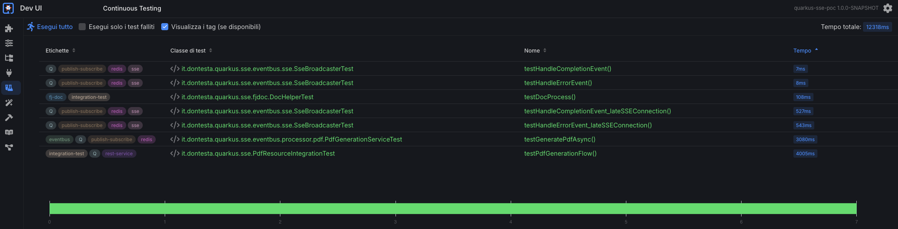
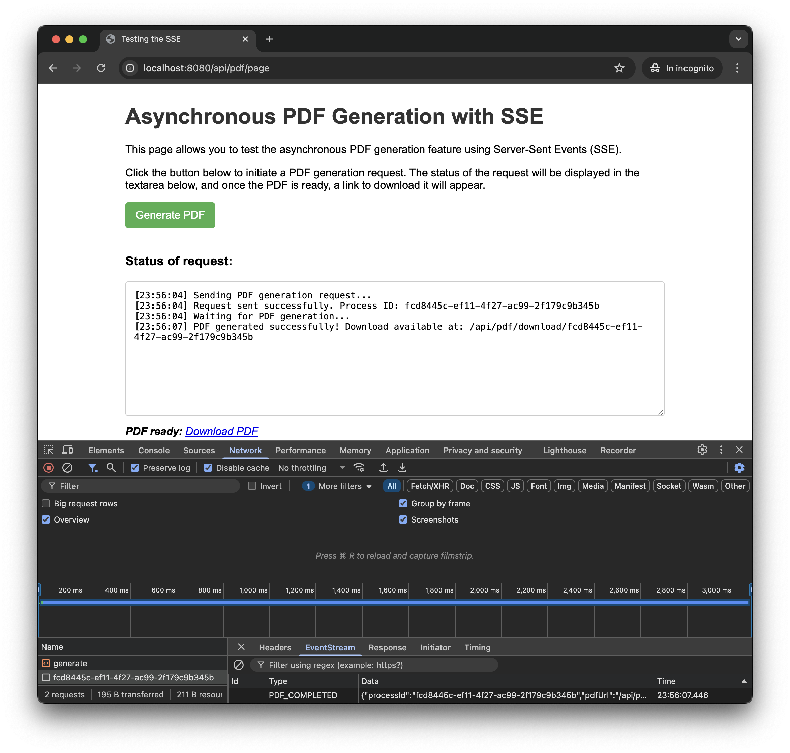
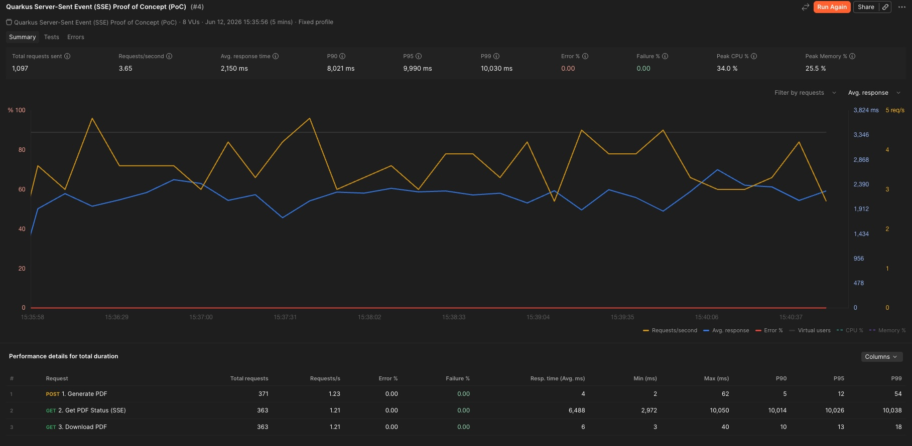

## Cronologia delle revisioni

| Versione | Data       | Autore          | Descrizione delle Modifiche                                                             |
|:---------|:-----------|:----------------|:----------------------------------------------------------------------------------------|
| 1.0.0    | 2025-06-21 | Antonio Musarra | Prima release                                                                           |
| 1.1.0    | 2025-06-22 | Antonio Musarra | Aggiunti i capitoli bonus, immagini e didascalie                                        |
| 1.2.0    | 2025-06-23 | Antonio Musarra | Aggiornamento per riflettere l'uso di MinIO, fj-doc e il nuovo formato degli eventi SSE |

[TOC]

<div style="page-break-after: always; break-after: page;"></div>

## Introduzione

Benvenuti alla **seconda puntata** di questa serie dedicata alla gestione di task asincroni con Server-Sent Events (SSE) e Quarkus.

**Nella prima puntata** abbiamo esplorato l'architettura dell'applicazione, analizzato gli endpoint REST e SSE, e visto come gestire le sottoscrizioni e gli aggiornamenti di stato tramite il componente `SseBroadcaster`.

**In questa seconda puntata** ci concentreremo su:

- Il servizio di generazione del PDF e l'implementazione del `PdfEventProcessor`
- I test dell'applicazione con JUnit e il client HTML
- L'uso di Postman per testare il flusso end-to-end
- Le conclusioni finali con considerazioni per la produzione
- I bonus del progetto, incluso il framework fj-doc

> **Prerequisito**: se non hai ancora letto la prima puntata, ti consiglio di farlo prima di proseguire: [Gestire task asincroni con Server-Sent Events (SSE) e Quarkus - Parte 1](./come-gestire-task-asincroni-con-sse-quarkus-parte1.md)

<div style="page-break-after: always; break-after: page;"></div>

## Il servizio di generazione del PDF

Il ruolo del `PdfEventProcessor` è quello di un worker asincrono, completamente disaccoppiato dall'endpoint REST. Si occupa di eseguire l'attività di generazione del PDF, che può richiedere tempo, e di caricare il risultato su uno storage a oggetti. Questo disaccoppiamento è fondamentale per garantire che l'endpoint REST rimanga reattivo e non blocchi il thread di I/O.

Vediamo quali sono le principali responsabilità del `PdfEventProcessor`:

- **Ascolto delle Richieste**: si registra programmaticamente sull'event bus all'avvio dell'applicazione per consumare i messaggi di tipo `PdfGenerationRequest`.
- **Esecuzione Asincrona**: utilizza un `CompletableFuture` e un `ScheduledExecutorService` dedicato per eseguire la logica bloccante (generazione PDF e upload su MinIO) al di fuori del thread di I/O, garantendo che l'event loop non venga mai bloccato.
- **Generazione e Archiviazione Reale**: utilizza la libreria `fj-doc` per creare il documento PDF e il client MinIO per caricarlo nello storage a oggetti.
- **Notifica del Risultato**: una volta che il task è completato (con successo o con errore), pubblica un evento (`PdfGenerationCompleted` o `PdfGenerationError`) sull'event bus, che verrà poi inoltrato al client corretto dal `SseBroadcaster`.

### Analisi del codice

Il processore viene inizializzato all'avvio dell'applicazione (`onStart`), dove imposta il consumer dell'event bus. Il metodo `handlePdfGenerationRequest` gestisce la richiesta in modo non bloccante, delegando il lavoro pesante a un `CompletableFuture`.

```java
@ApplicationScoped
public class PdfEventProcessor {

    // ... (campi, costruttore e metodo onStart)

    private void handlePdfGenerationRequest(Message<PdfGenerationRequest> message) {
        PdfGenerationRequest request = message.body();
        Log.debugf("Received PDF generation request with ID: %s", request.processId());

        generatePdfAsync(request.processId())
            .thenAccept(objectKey -> {
                // Notifica il completamento
                PdfGenerationCompleted completionEvent = new PdfGenerationCompleted(request.processId(), objectKey);
                eventBus.publish(completedDestination, completionEvent, ...);
                Log.debugf("PDF completion notification sent for ID: %s", request.processId());
            })
            .exceptionally(ex -> {
                // Notifica l'errore
                Log.errorf(ex, "Failed to process PDF generation for ID: %s", request.processId());
                PdfGenerationError errorEvent = new PdfGenerationError(request.processId(), ex.getCause().getMessage());
                eventBus.publish(errorsDestination, errorEvent, ...);
                return null;
            });
    }

    private CompletableFuture<String> generatePdfAsync(String processId) {
        // Simula un ritardo per scopi dimostrativi
        long delay = ThreadLocalRandom.current().nextLong(minDelayInSeconds, maxDelayInSeconds + 1);

        return CompletableFuture.supplyAsync(() -> {
            String objectKey = processId + ".pdf";
            try (ByteArrayOutputStream baos = new ByteArrayOutputStream()) {
                // 1. Genera il PDF usando fj-doc
                docHelper.getDocProcessConfig().fullProcess(...);

                // 2. Carica il PDF su MinIO
                byte[] pdfBytes = baos.toByteArray();
                minioClient.putObject(
                        PutObjectArgs.builder()
                                .bucket(bucketName)
                                .object(objectKey)
                                .stream(new ByteArrayInputStream(pdfBytes), pdfBytes.length, -1)
                                .contentType(MediaType.APPLICATION_OCTET_STREAM)
                                .build());
                return objectKey;
            } catch (Exception e) {
                throw new CompletionException(e);
            }
        }, CompletableFuture.delayedExecutor(delay, TimeUnit.SECONDS, executor));
    }
}
```
**Source Code 1**: Logica del `PdfEventProcessor` per la generazione e l'upload del PDF

<div style="page-break-after: always; break-after: page;"></div>

Il flusso operativo è il seguente:

1. **Consumo dell'Evento**: il metodo `handlePdfGenerationRequest` viene invocato quando un messaggio `PdfGenerationRequest` arriva sull'event bus.
2. **Avvio Task Asincrono**: il metodo chiama immediatamente `generatePdfAsync`, che restituisce un `CompletableFuture`. Questo permette al gestore dell'evento di terminare subito, senza bloccare il thread dell'event loop.
3. **Elaborazione in Background**: `generatePdfAsync` usa `CompletableFuture.supplyAsync` per eseguire il codice di generazione e upload su un thread di un pool dedicato (`executor`). Qui avvengono le operazioni bloccanti.
4. **Notifica tramite Callback**: al `CompletableFuture` sono collegate delle callback:
   - `thenAccept` viene eseguita in caso di successo e pubblica l'evento `PdfGenerationCompleted`.
   - `exceptionally` viene eseguita in caso di errore e pubblica l'evento `PdfGenerationError`.

Questo pattern garantisce un'esecuzione efficiente e non bloccante, sfruttando appieno le capacità di programmazione asincrona di Java e Quarkus.

<div style="page-break-after: always; break-after: page;"></div>

## Test dell'applicazione con JUnit e client HTML

Per garantire la qualità e l'affidabilità dell'applicazione, sono stati implementati test automatici utilizzando JUnit e il framework di test di Quarkus. Questi test verificano il corretto funzionamento degli endpoint REST e SSE, assicurando che l'applicazione risponda come previsto.

I test di integrazione coprono l'intero flusso: dalla richiesta di generazione del PDF, alla sottoscrizione SSE, fino alla ricezione dell'evento di completamento, verificando che tutti i componenti (`PdfResource`, `SseBroadcaster`, `PdfEventProcessor`) interagiscano correttamente.

A seguire lo screenshot della DevUI di Quarkus che mostra i test JUnit eseguiti con successo.



**Figura 1**: Quarkus DevUI - Test JUnit eseguiti con successo

Il progetto include anche una semplice pagina HTML per testare l'applicazione in modo manuale. Questa pagina consente di inviare una richiesta di generazione del PDF e di visualizzare gli aggiornamenti di stato in tempo reale.

Il file `src/main/resources/templates/pub/pdf-generator.html` contiene il codice JavaScript per interagire con il backend.

1. Click sul bottone "Generate PDF": viene inviata una richiesta POST a `/api/pdf/generate`.
2. Ricezione del `processId`: una volta ottenuto l'ID, il client lo usa per costruire l'URL dell'endpoint SSE.
3. Creazione dell'`EventSource`: viene istanziato un nuovo oggetto `EventSource` che apre una connessione persistente a `/api/pdf/status/{processId}`.
4. Gestione degli eventi: vengono registrati listener specifici per gli eventi inviati dal server:
    - `eventSource.addEventListener('PDF_COMPLETED', ...)`: questo handler viene invocato quando il server invia l'evento di completamento. Il payload dell'evento, un oggetto JSON contenente l'URL per il download, viene estratto da `event.data`. A questo punto, viene mostrato il link per il download e la connessione SSE viene chiusa (`eventSource.close()`).
    - `eventSource.addEventListener('PDF_ERROR', ...)`: gestisce eventuali errori di generazione segnalati dal server.
    - `eventSource.onerror`: gestisce eventuali errori di connessione.

```javascript
// ...
.then(processId => {
    appendToLog(`Request sent successfully. Process ID: ${processId}`);
    const eventSource = new EventSource(`/api/pdf/status/${processId}`);

    eventSource.addEventListener('PDF_COMPLETED', function(event) {
        const data = JSON.parse(event.data);
        appendToLog(`PDF generation completed. Download available at: ${data.pdfUrl}`);
        showDownloadLink(data.pdfUrl);
        eventSource.close();
    });

    eventSource.addEventListener('PDF_ERROR', function(event) {
        const data = JSON.parse(event.data);
        appendToLog(`ERROR: ${data.errorMessage}`);
        eventSource.close();
    });

    eventSource.onerror = function(err) {
        appendToLog('EventSource connection error.');
        eventSource.close();
    };
});
```

**Source Code 2**: Gestione degli eventi SSE nominati nel client HTML

A seguire uno screenshot della pagina HTML in esecuzione, che mostra il flusso di generazione del PDF e la ricezione degli aggiornamenti di stato tramite SSE.



**Figura 2**: Client HTML - Generazione PDF con SSE

Dai log della console dell'applicazione, possiamo vedere il flusso di esecuzione mostrato nel diagramma di sequenza. A seguire un esempio di log generato a fronte della richiesta di generazione del PDF eseguita dal client HTML.

```plaintext
2025-06-23 11:30:10,100 DEBUG [i.d.q.s.e.w.r.PdfResource] (vert.x-eventloop-thread-1) Starting the PDF generation for ID: a1b2c3d4-e5f6-7890-1234-567890abcdef
2025-06-23 11:30:10,105 DEBUG [i.d.q.s.e.w.r.PdfResource] (vert.x-eventloop-thread-1) Request for PDF generation for ID a1b2c3d4-e5f6-7890-1234-567890abcdef sent to the event bus.
2025-06-23 11:30:10,110 DEBUG [i.d.q.s.e.p.p.PdfEventProcessor] (vert.x-eventloop-thread-0) Received PDF generation request with ID: a1b2c3d4-e5f6-7890-1234-567890abcdef
2025-06-23 11:30:10,112 DEBUG [i.d.q.s.e.p.p.PdfEventProcessor] (vert.x-eventloop-thread-0) Scheduling PDF generation for process ID: a1b2c3d4-e5f6-7890-1234-567890abcdef with a delay of 25 seconds
2025-06-23 11:30:10,115 DEBUG [i.d.q.s.e.w.r.PdfResource] (vert.x-eventloop-thread-2) The client requested status for ID: a1b2c3d4-e5f6-7890-1234-567890abcdef
2025-06-23 11:30:10,118 DEBUG [i.d.q.s.e.b.SseBroadcaster] (vert.x-eventloop-thread-2) SSE stream created for processId: a1b2c3d4-e5f6-7890-1234-567890abcdef
2025-06-23 11:30:35,500 DEBUG [i.d.q.s.e.p.p.PdfEventProcessor] (executor-thread-1) PDF successfully generated and uploaded to MinIO with key: a1b2c3d4-e5f6-7890-1234-567890abcdef.pdf
2025-06-23 11:30:35,505 DEBUG [i.d.q.s.e.p.p.PdfEventProcessor] (executor-thread-1) Attempting to send PDF completion notification for ID: a1b2c3d4-e5f6-7890-1234-567890abcdef
2025-06-23 11:30:35,510 DEBUG [i.d.q.s.e.p.p.PdfEventProcessor] (executor-thread-1) PDF completion notification sent for ID: a1b2c3d4-e5f6-7890-1234-567890abcdef
2025-06-23 11:30:35,515 DEBUG [i.d.q.s.e.b.SseBroadcaster] (vert.x-eventloop-thread-3) Received PDF completion event for ID: a1b2c3d4-e5f6-7890-1234-567890abcdef
2025-06-23 11:30:35,520 DEBUG  [i.d.q.s.e.b.SseBroadcaster] (vert.x-eventloop-thread-3) Sent PDF_COMPLETED event for process ID: a1b2c3d4-e5f6-7890-1234-567890abcdef
```

**Console 1**: Log generato durante la generazione del PDF

Dal log è possibile notare l'uso dell'event loop di Vert.x (`vert.x-eventloop-thread-*`) per le operazioni non bloccanti (gestione richieste HTTP, eventi) e di un thread del pool dedicato (`executor-thread-1`) per l'esecuzione della generazione del PDF, che è un'operazione bloccante.

<div style="page-break-after: always; break-after: page;"></div>

## Test dell'applicazione con Postman

All'interno di questa PoC, è stata inclusa una collection di Postman nel file `src/main/postman/collection/postman_collection.json`. Questa collection permette di testare facilmente il flusso end-to-end.

La collection contiene due richieste da eseguire in sequenza:

1. **Generate PDF**
   - **Azione**: Esegue una richiesta `POST` all'endpoint `/api/pdf/generate`.
   - **Scopo**: Avvia il processo di generazione asincrona del PDF. Il server risponde immediatamente con un ID di processo univoco (UUID).
   - **Automazione**: Lo script nella tab "Tests" di questa richiesta cattura automaticamente l'ID di processo dalla risposta e lo salva in una variabile di collezione (`processId`) per utilizzarlo nel passo successivo.

2. **Get PDF Status (SSE)**
   - **Azione**: Esegue una richiesta `GET` all'endpoint `/api/pdf/status/{{processId}}`.
   - **Scopo**: Utilizza l'ID salvato in precedenza per aprire una connessione Server-Sent Events e mettersi in ascolto degli aggiornamenti di stato.
   - **Risultato Atteso**: Postman manterrà la connessione aperta. Dopo il ritardo gestito dal `PdfEventProcessor`, il server invierà un evento nominato `PDF_COMPLETED`. Postman visualizzerà la notifica ricevuta, che sarà simile a:
     
      ```
      event: PDF_COMPLETED
      data: {"processId":"xxxxxxxx-xxxx-xxxx-xxxx-xxxxxxxxxxxx","pdfUrl":"/api/pdf/download/xxxxxxxx-xxxx-xxxx-xxxx-xxxxxxxxxxxx"}
      ```
      
   - **Automazione**: Gli script di test associati verificano che la risposta contenga l'evento `PDF_COMPLETED` e che il payload JSON contenga un `pdfUrl` valido.

A seguire uno screenshot di Postman che mostra l'esecuzione della richiesta SSE e la ricezione dell'evento di completamento.



**Figura 3**: Esecuzione del test SSE con Postman

<div style="page-break-after: always; break-after: page;"></div>

## Conclusioni

Questa Proof of Concept (PoC) dimostra in modo efficace come implementare un sistema robusto e scalabile per la gestione di task asincroni in un'applicazione Quarkus. Sfruttando i Server-Sent Events (SSE), l'Event Bus di Vert.x e la programmazione asincrona, abbiamo costruito un flusso completo che notifica un client in tempo reale senza ricorrere a polling inefficiente o alla complessità dei WebSocket.

L'architettura presentata si basa su una chiara **separazione delle responsabilità**:

- **`PdfResource`**: gestisce l'esposizione degli endpoint REST e SSE, agendo come punto di ingresso.
- **`SseBroadcaster`**: centralizza la gestione delle connessioni SSE, disaccoppiando la logica di notifica dagli endpoint.
- **`PdfEventProcessor`**: orchestra il lavoro pesante in background, eseguendo la generazione del PDF e l'upload su MinIO in modo completamente asincrono tramite `CompletableFuture` su un pool di thread dedicato.

A differenza di una semplice simulazione, la PoC integra tecnologie reali come **fj-doc** per la generazione di documenti e **MinIO** per lo storage a oggetti, mostrando un caso d'uso realistico e pronto per essere adattato a contesti di produzione.

Il modello implementato, che prevede eventi nominati (`PDF_COMPLETED`, `PDF_ERROR`) con payload JSON, è flessibile e può essere facilmente esteso per comunicare stati intermedi (es. `GENERATION_STARTED`, `UPLOADING_TO_STORAGE`) o informazioni più dettagliate sul progresso.

Tuttavia, come discusso, l'attuale `SseBroadcaster` basato su una mappa in-memory rappresenta un limite per lo scaling orizzontale. Per un ambiente di produzione distribuito, il passo successivo sarebbe sostituire questo meccanismo con un sistema di messaggistica esterno (come Redis Pub/Sub, RabbitMQ o Kafka) per garantire che le notifiche raggiungano i client corretti, indipendentemente dall'istanza dell'applicazione che gestisce la connessione.

In sintesi, la combinazione delle funzionalità reattive di Quarkus con i pattern di concorrenza di Java offre un toolkit potente per costruire applicazioni moderne, resilienti e performanti, in grado di offrire un'eccellente esperienza utente.

<div style="page-break-after: always; break-after: page;"></div>

## Bonus: codice sorgente completo su GitHub

Il codice sorgente completo della PoC è disponibile su GitHub, dove puoi esplorare l'implementazione dettagliata e testare l'applicazione direttamente nel tuo ambiente. L'indirizzo del repository è [https://github.com/amusarra/quarkus-sse-poc].

Il README.md del repository contiene istruzioni dettagliate su come eseguire l'applicazione, configurare MinIO e testare gli endpoint.

> Non dimenticare di mettere una stella ⭐ al progetto se lo trovi utile!

## Bonus: Un framework per la generazione di documenti

A differenza di una semplice simulazione, questa PoC non si limita a un ritardo temporale, ma genera un documento PDF reale. Per questa operazione è stato scelto **fj-doc**, un framework open-source per la generazione di documenti in Java.

**fj-doc** ([https://github.com/fugerit-org/fj-doc](https://github.com/fugerit-org/fj-doc)), sviluppato da [Matteo Franci](https://www.linkedin.com/in/matteo-franci/), è una libreria estremamente versatile che semplifica la creazione di documenti in vari formati, tra cui:

- PDF
- HTML
- XML
- XLS/XLSX
- CSV

Uno dei suoi punti di forza è la flessibilità: permette di definire la struttura del documento tramite file di configurazione XML, separando la logica di business dalla presentazione. Supporta inoltre l'uso di template engine come Freemarker per rendere dinamica la creazione dei contenuti. 

* Qui <https://venusdocs.fugerit.org/guide/> trovi una guida completa su come utilizzare fj-doc e creare documenti in modo semplice e intuitivo. 
* Qui <https://docs.fugerit.org/fj-doc-playground/home/> trovi un playground online per testare le funzionalità di fj-doc senza dover configurare nulla localmente.

All'interno di questa PoC, `fj-doc` è integrato nel `PdfEventProcessor`. Il metodo `generatePdfAsync` utilizza una classe helper (`DocHelper`) per invocare il processo di generazione di `fj-doc`, che crea il PDF in un `ByteArrayOutputStream`. Il byte array risultante viene poi utilizzato per l'upload su MinIO, completando un flusso di lavoro realistico e funzionale.

<div style="page-break-after: always; break-after: page;"></div>

## Risorse Utili

- [Quarkus Official Documentation](https://quarkus.io/guides/)
- [Server-Sent Events - MDN Web Docs](https://developer.mozilla.org/en-US/docs/Web/API/Server-sent_events)
- [Quarkus Event Bus Guide](https://quarkus.io/guides/reactive-event-bus)
- [Quarkus SSE Guide](https://quarkus.io/guides/rest#server-sent-event-sse-support)
- [Quarkus Event Bus - Come sfruttarlo al massimo: utilizzi e vantaggi](https://bit.ly/3VTG2dt)
- [Quarkus Event Bus Logging Filter JAX-RS](https://github.com/amusarra/eventbus-logging-filter-jaxrs)
- [fj-doc Framework](https://github.com/fugerit-org/fj-doc)
- [MinIO Documentation](https://min.io/docs/minio/linux/index.html)

> **Prima puntata**: [Gestire task asincroni con Server-Sent Events (SSE) e Quarkus - Parte 1](./come-gestire-task-asincroni-con-sse-quarkus-parte1.md)