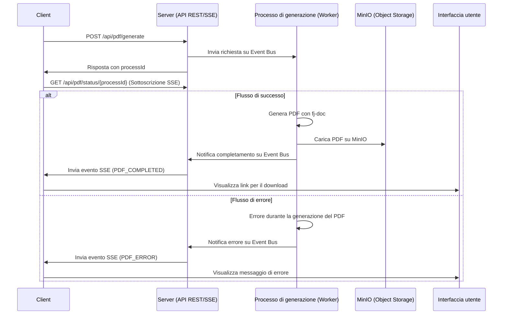
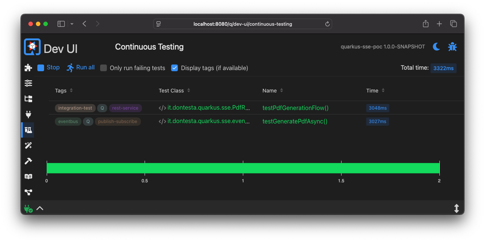
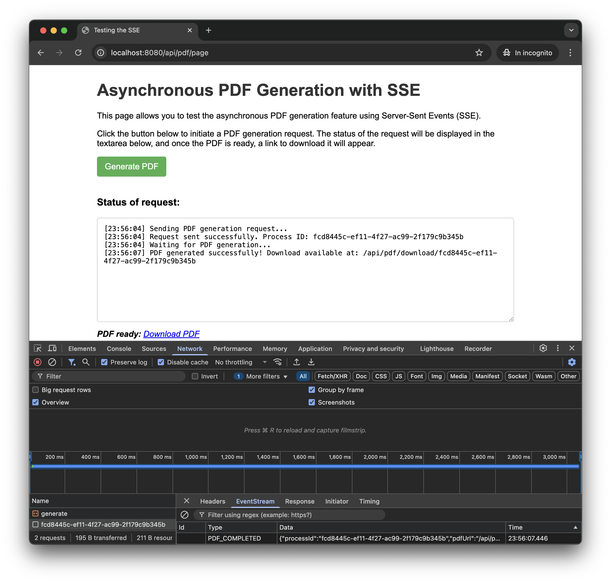
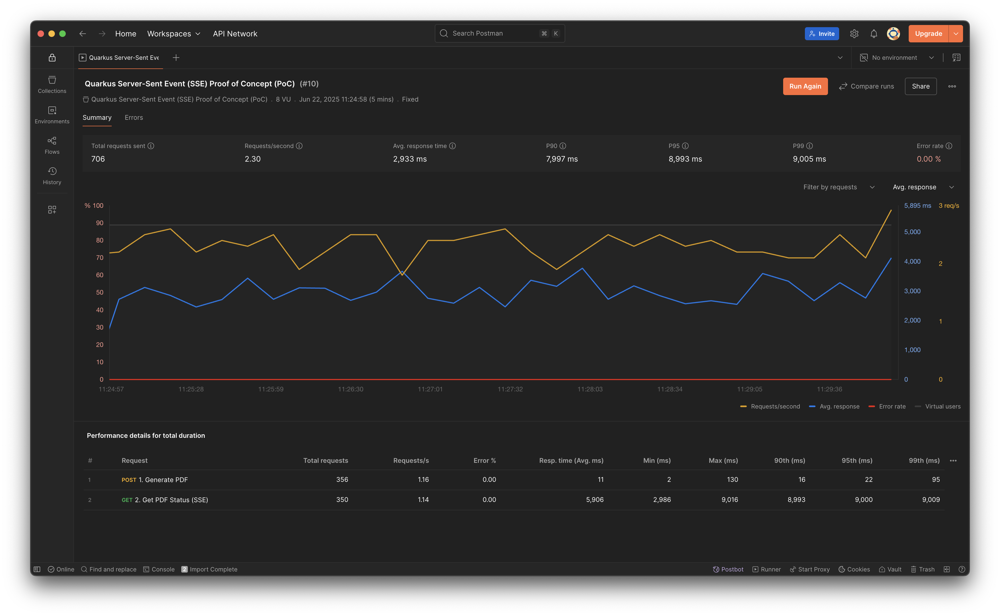

## Cronologia delle revisioni

| Versione | Data       | Autore          | Descrizione delle Modifiche                                                             |
|:---------|:-----------|:----------------|:----------------------------------------------------------------------------------------|
| 1.0.0    | 2025-06-21 | Antonio Musarra | Prima release                                                                           |
| 1.1.0    | 2025-06-22 | Antonio Musarra | Aggiunti i capitoli bonus, immagini e didascalie                                        |
| 1.2.0    | 2025-06-23 | Antonio Musarra | Aggiornamento per riflettere l'uso di MinIO, fj-doc e il nuovo formato degli eventi SSE |

[TOC]

<div style="page-break-after: always; break-after: page;"></div>

## Introduzione

La gestione di task asincroni in un'applicazione web può essere una sfida, specialmente quando si tratta di operazioni che richiedono molto tempo, come la generazione di report o l'elaborazione di file. Una soluzione efficace per notificare lo stato di tali operazioni ai client è l'uso dei **Server-Sent Events (SSE)**. Questi eventi consentono al server di inviare aggiornamenti in tempo reale a un client, migliorando l'esperienza utente e la reattività dell'applicazione.

In questo articolo, analizzeremo un'applicazione Proof of Concept (PoC) che dimostra come utilizzare i Server-Sent Events (SSE) per notificare a un client lo stato di un processo asincrono di lunga durata, come la generazione di un PDF.
Esploreremo l'architettura, il codice sorgente e gli strumenti per testare la soluzione.
A differenza di una semplice simulazione, questa PoC genera realmente un file PDF utilizzando la libreria **fj-doc** e lo archivia su uno storage a oggetti **MinIO**.

> **Bonus**: alla fine dell'articolo, troverai il link al progetto completo su GitHub, che include un'applicazione Quarkus funzionante con SSE e un client HTML per testare la funzionalità. Inoltre, sono inclusi test automatici con JUnit per garantire la qualità del codice e la corretta integrazione tra i componenti + una collection di Postman per testare il flusso end-to-end.

## Cosa sono i Server-Sent Events (SSE)?

I Server-Sent Events sono uno standard web che permette a un server di inviare aggiornamenti a un client in modo pro-attivo su una singola connessione HTTP. A differenza di WebSockets, la comunicazione è unidirezionale: solo dal server al client. Quali sono i vantaggi principali dei SSE?

- **Semplicità**: SSE si basa su HTTP/1.1 ed è più semplice da implementare sia lato client che server rispetto a WebSockets.
- **Efficienza**: evita overhead del polling continuo, dove il client deve chiedere ripetutamente al server se ci sono novità.
- **Standard Web**: è supportato nativamente dalla maggior parte dei browser moderni tramite l'oggetto EventSource.
- **Reconnect Automatica**: i client SSE gestiscono automaticamente la reconnect in caso di perdita del collegamento.

In questa PoC, SSE viene utilizzato per informare l'utente sullo stato di una richiesta di generazione di un PDF.
Il client avvia la richiesta, riceve un ID e si mette in ascolto su un canale SSE in attesa di ricevere la notifica di avvenuta generazione del PDF.
Questo approccio consente di mantenere l'interfaccia utente reattiva e di evitare il blocco del thread principale durante operazioni potenzialmente lunghe.

<div style="page-break-after: always; break-after: page;"></div>

## Architettura e flusso dell'applicazione

L'architettura dell'applicazione è semplice ma efficace. Il client invia una richiesta al server per avviare la generazione del PDF. Il server risponde con un ID univoco per la richiesta e inizia il processo di generazione in background. Durante questo processo, il server invia aggiornamenti di stato tramite SSE al client, che poi deciderà come usare queste informazioni.

Il flusso dell'applicazione può essere riassunto come segue:



Figura 1: Flusso dell'applicazione con Server-Sent Events

Quali sono i componenti principali di questa architettura?

- **Client**: invia la richiesta di generazione del PDF e si mette in ascolto per gli aggiornamenti.
- **Server**: gestisce la richiesta, avvia il processo di generazione e invia gli aggiornamenti tramite SSE.
- **Processo di generazione**: esegue la logica per generare il PDF in background utilizzando la libreria `fj-doc` e salvando il risultato su uno storage a oggetti MinIO.
- **SSE**: gestisce la comunicazione degli aggiornamenti di stato dal server al client.
- **Interfaccia utente**: mostra lo stato della generazione del PDF all'utente.

Questa architettura consente di separare le responsabilità, mantenendo il codice pulito e facilmente manutenibile. Il server gestisce la logica di business, mentre il client si occupa della presentazione e dell'interazione con l'utente.

Questa PoC è stata realizzata utilizzando il framework cloud native Quarkus. Quali sono i componenti principali di Quarkus utilizzati in questa PoC?

- **Quarkus REST**: per gestire le richieste HTTP e le risposte usando il modello non bloccante e il supporto per SSE.
- **Quarkus Event Bus**: per gestire la comunicazione asincrona tra i vari componenti dell'applicazione.
- **Quarkus Mutiny**: per gestire la programmazione reattiva e le operazioni asincrone in modo semplice e intuitivo.
- **Quarkus MinIO Client**: per interagire con lo storage a oggetti MinIO e gestire il caricamento dei file PDF generati.

<div style="page-break-after: always; break-after: page;"></div>

## Analisi del codice sorgente

Il backend dell'applicazione è costituito da due componenti principali:

1. Endpoint REST per avviare la generazione del PDF e restituire l'ID della richiesta.
2. Endpoint SSE per inviare aggiornamenti di stato al client.
3. Un componente che gestisce gli eventi SSE e le notifiche di completamento o errore della generazione del PDF.
4. Un componente che gestisce la logica di generazione del PDF e invia gli aggiornamenti di stato usando l'Event Bus di Quarkus.

### Endpoint REST

L'endpoint REST `/generate` è responsabile dell'avvio della generazione del PDF e della restituzione dell'ID della richiesta. A seguire l'implementazione di questo endpoint.

```java
@POST
@Path("/generate")
@Produces(MediaType.TEXT_PLAIN)
public Uni<String> generatePdf() {
    String processId = UUID.randomUUID().toString();
    Log.debugf("Starting the PDF generation for ID: %s", processId);

    // Pubblica una richiesta sull'event bus
    eventBus.publish(
        requestsDestination,
        new PdfGenerationRequest(processId),
        new DeliveryOptions().setCodecName(PdfGenerationRequestCodec.CODEC_NAME));

    Log.debugf("Request for PDF generation for ID %s sent to the event bus.", processId);

    return Uni.createFrom().item(processId);
}
```

Source Code 1: Implementazione dell'endpoint REST per la richiesta di generazione del PDF

Questo è un tipo di operazione non bloccante che restituisce un `Uni<String>`, per essere eseguita sul thread di I/O (event loop), garantendo così prestazioni elevate e scalabilità. Il metodo genera un ID univoco per la richiesta e pubblica un evento sull'Event Bus di Quarkus per avviare il processo di generazione del PDF.

L'endpoint `/download/{processId}` permette di scaricare il PDF generato dal servizio di storage S3 MinIO.
Quest'operazione è anch'essa non bloccante e restituisce un `Uni<Response>`, che rappresenta la risposta HTTP con il file PDF come contenuto. La logica bloccante per il download del PDF da MinIO viene eseguita all'interno di un blocco `Uni.createFrom().item(() -> {...})`, per garantire che non blocchi il thread di I/O.

```java
@GET
@Path("/download/{processId}")
@Produces(MediaType.APPLICATION_OCTET_STREAM)
public Uni<Response> downloadPdf(@PathParam("processId") String processId) {
    return Uni.createFrom().item(() -> {
        String objectKey = processId + ".pdf";
        try {
            InputStream stream = minioClient.getObject(
                    GetObjectArgs.builder()
                            .bucket(bucketName)
                            .object(objectKey)
                            .build());

            Response.ResponseBuilder response = Response.ok(stream);
            response.header(HttpHeaders.CONTENT_DISPOSITION, "attachment;filename=" + objectKey);
            response.header(HttpHeaders.CONTENT_TYPE, MediaType.APPLICATION_OCTET_STREAM);
            return response.build();
        } catch (ErrorResponseException e) {
            if ("NoSuchKey".equals(e.errorResponse().code())) {
                Log.warnf("PDF with key: %s not found in MinIO bucket: %s", objectKey, bucketName);
                return Response.status(Response.Status.NOT_FOUND).build();
            }
            Log.errorf(e, "Failed to download PDF with key: %s from MinIO bucket: %s", objectKey, bucketName);
            return Response.serverError().entity(e.getMessage()).build();
        } catch (Exception e) {
            Log.errorf(e, "An unexpected error occurred while downloading PDF with key: %s", objectKey);
            return Response.serverError().entity(e.getMessage()).build();
        }
    });
}
```

Source Code 2: Implementazione dell'endpoint REST per il download del PDF

> **Approfondimento**: per saperne di più su Quarkus e il suo Event Bus, consulta la [documentazione ufficiale](https://quarkus.io/guides/reactive-event-bus).
> Per ulteriori approfondimenti sull'Event Bus, consiglio di leggere l'eBook [Quarkus Event Bus - Come sfruttarlo al massimo: utilizzi e vantaggi](https://bit.ly/3VTG2dt).

<div style="page-break-after: always; break-after: page;"></div>

### Endpoint SSE

L'endpoint SSE `/status/{id}` e di conseguenza il metodo `getPdfStatus`, è il cuore del meccanismo di notifica tramite Server-Sent Events (SSE).
A seguire l'implementazione di questo endpoint.

```java
@GET
@Path("/status/{processId}")
@Produces(MediaType.SERVER_SENT_EVENTS)
public Multi<OutboundSseEvent> getPdfStatus(@PathParam("processId") String processId) {
   Log.debugf("The client requested status for ID: %s", processId);
   return sseBroadcaster.createStream(processId);
}
```

Source Code 3: Implementazione dell'endpoint SSE per gli aggiornamenti di stato del PDF

Lo scopo di questo metodo è di stabilire una connessione persistente tra il client (ad esempio, un browser) e il server. Attraverso questa connessione, il server può inviare aggiornamenti di stato (eventi) al client in modo proattivo, senza che il client debba continuamente interrogare il server (polling).

L'annotazione `@Produces(MediaType.SERVER_SENT_EVENTS)` indica che questo endpoint produrrà eventi SSE, che saranno inviati al client in formato `text/event-stream`, che è lo standard per le comunicazioni SSE. Dice a Quarkus e al client di trattare questa connessione come un flusso di eventi.

Il tipo di ritorno `Multi<OutboundSseEvent>` rappresenta un flusso di eventi (di zero o più elementi) che possono essere inviati al client.
`Multi` è una parte del framework Mutiny di Quarkus, che consente di gestire flussi reattivi in modo semplice e intuitivo. In questo contesto, ogni `OutboundSseEvent` emesso dal `Multi` verrà inviato come un singolo evento SSE al client.

Il metodo `sseBroadcaster.createStream(processId)` crea un flusso di eventi SSE associato all'ID del processo specificato utilizzando il componente `SseBroadcaster` responsabile di:

1. Registrare l'interesse del client per quel `processId`.
2. Restituire un `Multi` a cui il client si "sottoscrive".
3. Quando un evento (come `PdfGenerationCompleted`) per quel `processId` viene ricevuto da un'altra parte dell'applicazione (ad esempio, dal worker), il `SseBroadcaster` lo invierà (`emit`) sul `Multi` appropriato, facendolo arrivare al client connesso.

In sintesi, quando un client chiama `GET /api/pdf/status/{processId}`, questo metodo apre un canale di comunicazione SSE e lo "sintonizza" per ricevere solo gli eventi relativi a quel `processId`, delegando tutta la gestione del flusso all'oggetto `SseBroadcaster`.

<div style="page-break-after: always; break-after: page;"></div>

#### Nota sulla Gestione delle Connessioni SSE con SseBroadcaster

Nell'implementazione corrente, la gestione delle connessioni Server-Sent Events (SSE) è stata centralizzata nel componente `SseBroadcaster`.
Questo servizio astrae la logica di creazione, memorizzazione e notifica dei flussi di eventi, semplificando il codice dell'endpoint `PdfResource`.

L'implementazione sottostante del `SseBroadcaster` si basa su un meccanismo **in-memory** (come una `ConcurrentMap`) locale alla singola istanza della JVM.
Questo approccio, sebbene efficace per una singola istanza, presenta limiti significativi in un ambiente di produzione distribuito (es. cluster Kubernetes, più istanze dietro un load balancer):

- **Stato Locale**: la mappa degli emitter risiede nella memoria di una singola istanza. Se l'applicazione viene scalata orizzontalmente, ogni istanza avrà il proprio `SseBroadcaster` con una mappa isolata e non condivisa.
- **Problema di Routing**: un client potrebbe stabilire la connessione SSE con l'istanza A, ma l'evento di completamento del PDF potrebbe essere gestito dall'istanza B. L'istanza B non avrebbe alcun riferimento all'emitter del client (che si trova sull'istanza A) e non potrebbe inviare la notifica.
- **Mancanza di Resilienza**: se l'istanza che detiene la connessione si riavvia o va in crash, tutte le connessioni attive e i relativi emitter vengono persi.

Per superare questi limiti, il meccanismo di broadcast in-memory dovrebbe essere sostituito da un sistema di messaggistica **Publish/Subscribe esterno**, come Redis Pub/Sub, RabbitMQ o Apache Kafka.

Il flusso modificato sarebbe:

1. Quando un client si connette, il `SseBroadcaster` dell'istanza corrente crea l'emitter e sottoscrive un canale/topic univoco sul message broker (es. `pdf-status-channel:<processId>`).
2. Quando un worker (su qualsiasi istanza) completa la generazione del PDF, pubblica un messaggio su quel canale specifico nel broker.
3. Il broker distribuisce il messaggio a tutti i sottoscrittori. L'istanza che ha la connessione SSE attiva riceve il messaggio.
4. A questo punto, il `SseBroadcaster` di quell'istanza riceve il messaggio dal broker e invia la notifica al client tramite l'emitter corretto.

Questo pattern rende le istanze dell'applicazione stateless rispetto alla gestione delle sessioni SSE, permettendo di scalare orizzontalmente in modo affidabile.

<div style="page-break-after: always; break-after: page;"></div>

### Gestione della sottoscrizione e degli aggiornamenti di stato

La responsabilità di ascoltare gli eventi dall'Event Bus e di inviare le notifiche SSE ai client è stata assegnata un componente dedicato: `SseBroadcaster`. Questo migliora la separazione delle responsabilità e rende il codice più pulito e facile da manutenere.

Il `SseBroadcaster` si inizializza all'avvio dell'applicazione, sottoscrivendo i consumer per gli eventi di completamento e di errore.

```java
@ApplicationScoped
public class SseBroadcaster {

   // ... (campi e costruttore)

   void onStart(@Observes StartupEvent ev) {
      Log.debug("SseBroadcaster is initializing...");
      eventBus.<PdfGenerationCompleted>consumer(completedDestination)
              .handler(this::handleCompletionEvent);
      eventBus.<PdfGenerationError>consumer(errorsDestination)
              .handler(this::handleErrorEvent);
      Log.debug("SseBroadcaster initialized and listening for completion and error events.");
   }

   private void handleCompletionEvent(Message<PdfGenerationCompleted> message) {
      PdfGenerationCompleted event = message.body();
      String processId = event.processId();
      BroadcastProcessor<OutboundSseEvent> processor = processors.get(processId);

      if (processor != null) {
         OutboundSseEvent sseEvent = sse.newEventBuilder()
                 .name("PDF_COMPLETED")
                 .data(event)
                 .mediaType(MediaType.APPLICATION_JSON_TYPE)
                 .build();
         processor.onNext(sseEvent);
         processor.onComplete();
         processors.remove(processId);
      } else {
         Log.warnf("No active SSE processor found for processId: %s", processId);
      }
   }

   // ... (metodo handleErrorEvent e altri)
}
```

Source Code 4: Gestione centralizzata degli eventi nel SseBroadcaster

Ogni qualvolta viene ricevuto un evento di completamento della generazione del PDF, il metodo `handlePdfCompletedEvent` viene chiamato per inviare l'aggiornamento di stato al client tramite l'emitter associato all'ID del processo. Lo stesso vale per gli eventi di errore, gestiti dal metodo `handlePdfErrorEvent`.

Come funziona:

1. Inizializzazione (`@Observes StartupEvent`): all'avvio dell'applicazione, Quarkus invoca il metodo `onStart`. Questo metodo registra i consumer per due destinazioni sull'Event Bus: una per gli eventi di successo (`completedDestination`) e una per gli errori (`errorsDestination`).
2. Gestione Eventi:
   - Quando il worker pubblica un evento `PdfGenerationCompleted`, il metodo `handleCompletionEvent` viene invocato.
   - Quando il worker pubblica un evento `PdfGenerationError`, viene chiamato `handleErrorEvent`.
3. Invio Notifica SSE: entrambi i metodi handler recuperano il `BroadcastProcessor` corretto dalla mappa `processors` usando il `processId`. Creano un evento SSE nominato (`PDF_COMPLETED` o `PDF_ERROR`), lo inviano al client (`processor.onNext(...)`) e infine chiudono il flusso (`processor.onComplete()`) e rimuovono il processore dalla mappa, poiché il processo è terminato.

<div style="page-break-after: always; break-after: page;"></div>

## Il servizio di generazione del PDF

Il ruolo del `PdfEventProcessor` è quello di un worker asincrono, completamente disaccoppiato dall'endpoint REST. Si occupa di eseguire l'attività di generazione del PDF, che può richiedere tempo, e di caricare il risultato su uno storage a oggetti. Questo disaccoppiamento è fondamentale per garantire che l'endpoint REST rimanga reattivo e non blocchi il thread di I/O.

Vediamo quali sono le principali responsabilità del `PdfEventProcessor`:

- **Ascolto delle Richieste**: si registra programmaticamente sull'event bus all'avvio dell'applicazione per consumare i messaggi di tipo `PdfGenerationRequest`.
- **Esecuzione Asincrona**: utilizza un `CompletableFuture` e un `ScheduledExecutorService` dedicato per eseguire la logica bloccante (generazione PDF e upload su MinIO) al di fuori del thread di I/O, garantendo che l'event loop non venga mai bloccato.
- **Generazione e Archiviazione Reale**: utilizza la libreria `fj-doc` per creare il documento PDF e il client MinIO per caricarlo nello storage a oggetti.
- **Notifica del Risultato**: una volta che il task è completato (con successo o con errore), pubblica un evento (`PdfGenerationCompleted` o `PdfGenerationError`) sull'event bus, che verrà poi inoltrato al client corretto dal `SseBroadcaster`.

### Analisi del codice

Il processore viene inizializzato all'avvio dell'applicazione (`onStart`), dove imposta il consumer dell'event bus. Il metodo `handlePdfGenerationRequest` gestisce la richiesta in modo non bloccante, delegando il lavoro pesante a un `CompletableFuture`.

```java
@ApplicationScoped
public class PdfEventProcessor {

    // ... (campi, costruttore e metodo onStart)

    private void handlePdfGenerationRequest(Message<PdfGenerationRequest> message) {
        PdfGenerationRequest request = message.body();
        Log.debugf("Received PDF generation request with ID: %s", request.processId());

        generatePdfAsync(request.processId())
            .thenAccept(objectKey -> {
                // Notifica il completamento
                PdfGenerationCompleted completionEvent = new PdfGenerationCompleted(request.processId(), objectKey);
                eventBus.publish(completedDestination, completionEvent, ...);
                Log.debugf("PDF completion notification sent for ID: %s", request.processId());
            })
            .exceptionally(ex -> {
                // Notifica l'errore
                Log.errorf(ex, "Failed to process PDF generation for ID: %s", request.processId());
                PdfGenerationError errorEvent = new PdfGenerationError(request.processId(), ex.getCause().getMessage());
                eventBus.publish(errorsDestination, errorEvent, ...);
                return null;
            });
    }

    private CompletableFuture<String> generatePdfAsync(String processId) {
        // Simula un ritardo per scopi dimostrativi
        long delay = ThreadLocalRandom.current().nextLong(minDelayInSeconds, maxDelayInSeconds + 1);

        return CompletableFuture.supplyAsync(() -> {
            String objectKey = processId + ".pdf";
            try (ByteArrayOutputStream baos = new ByteArrayOutputStream()) {
                // 1. Genera il PDF usando fj-doc
                docHelper.getDocProcessConfig().fullProcess(...);

                // 2. Carica il PDF su MinIO
                byte[] pdfBytes = baos.toByteArray();
                minioClient.putObject(
                        PutObjectArgs.builder()
                                .bucket(bucketName)
                                .object(objectKey)
                                .stream(new ByteArrayInputStream(pdfBytes), pdfBytes.length, -1)
                                .contentType(MediaType.APPLICATION_OCTET_STREAM)
                                .build());
                return objectKey;
            } catch (Exception e) {
                throw new CompletionException(e);
            }
        }, CompletableFuture.delayedExecutor(delay, TimeUnit.SECONDS, executor));
    }
}
```
Source Code 5: Logica del `PdfEventProcessor` per la generazione e l'upload del PDF

Il flusso operativo è il seguente:

1. **Consumo dell'Evento**: il metodo `handlePdfGenerationRequest` viene invocato quando un messaggio `PdfGenerationRequest` arriva sull'event bus.
2. **Avvio Task Asincrono**: il metodo chiama immediatamente `generatePdfAsync`, che restituisce un `CompletableFuture`. Questo permette al gestore dell'evento di terminare subito, senza bloccare il thread dell'event loop.
3. **Elaborazione in Background**: `generatePdfAsync` usa `CompletableFuture.supplyAsync` per eseguire il codice di generazione e upload su un thread di un pool dedicato (`executor`). Qui avvengono le operazioni bloccanti.
4. **Notifica tramite Callback**: al `CompletableFuture` sono collegate delle callback:
   - `thenAccept` viene eseguita in caso di successo e pubblica l'evento `PdfGenerationCompleted`.
   - `exceptionally` viene eseguita in caso di errore e pubblica l'evento `PdfGenerationError`.

Questo pattern garantisce un'esecuzione efficiente e non bloccante, sfruttando appieno le capacità di programmazione asincrona di Java e Quarkus.

<div style="page-break-after: always; break-after: page;"></div>

## Test dell'applicazione con JUnit e client HTML

Per garantire la qualità e l'affidabilità dell'applicazione, sono stati implementati test automatici utilizzando JUnit e il framework di test di Quarkus. Questi test verificano il corretto funzionamento degli endpoint REST e SSE, assicurando che l'applicazione risponda come previsto.

I test di integrazione coprono l'intero flusso: dalla richiesta di generazione del PDF, alla sottoscrizione SSE, fino alla ricezione dell'evento di completamento, verificando che tutti i componenti (`PdfResource`, `SseBroadcaster`, `PdfEventProcessor`) interagiscano correttamente.

A seguire lo screenshot della DevUI di Quarkus che mostra i test JUnit eseguiti con successo.



Figura 2: Quarkus DevUI - Test JUnit eseguiti con successo

Il progetto include anche una semplice pagina HTML per testare l'applicazione in modo manuale. Questa pagina consente di inviare una richiesta di generazione del PDF e di visualizzare gli aggiornamenti di stato in tempo reale.

Il file `src/main/resources/templates/pub/pdf-generator.html` contiene il codice JavaScript per interagire con il backend.

1. Click sul bottone "Generate PDF": viene inviata una richiesta POST a `/api/pdf/generate`.
2. Ricezione del `processId`: una volta ottenuto l'ID, il client lo usa per costruire l'URL dell'endpoint SSE.
3. Creazione dell'`EventSource`: viene istanziato un nuovo oggetto `EventSource` che apre una connessione persistente a `/api/pdf/status/{processId}`.
4. Gestione degli eventi: vengono registrati listener specifici per gli eventi inviati dal server:
    - `eventSource.addEventListener('PDF_COMPLETED', ...)`: questo handler viene invocato quando il server invia l'evento di completamento. Il payload dell'evento, un oggetto JSON contenente l'URL per il download, viene estratto da `event.data`. A questo punto, viene mostrato il link per il download e la connessione SSE viene chiusa (`eventSource.close()`).
    - `eventSource.addEventListener('PDF_ERROR', ...)`: gestisce eventuali errori di generazione segnalati dal server.
    - `eventSource.onerror`: gestisce eventuali errori di connessione.

```javascript
// ...
.then(processId => {
    appendToLog(`Request sent successfully. Process ID: ${processId}`);
    const eventSource = new EventSource(`/api/pdf/status/${processId}`);

    eventSource.addEventListener('PDF_COMPLETED', function(event) {
        const data = JSON.parse(event.data);
        appendToLog(`PDF generation completed. Download available at: ${data.pdfUrl}`);
        showDownloadLink(data.pdfUrl);
        eventSource.close();
    });

    eventSource.addEventListener('PDF_ERROR', function(event) {
        const data = JSON.parse(event.data);
        appendToLog(`ERROR: ${data.errorMessage}`);
        eventSource.close();
    });

    eventSource.onerror = function(err) {
        appendToLog('EventSource connection error.');
        eventSource.close();
    };
});
```

Source Code 6: Gestione degli eventi SSE nominati nel client HTML

A seguire uno screenshot della pagina HTML in esecuzione, che mostra il flusso di generazione del PDF e la ricezione degli aggiornamenti di stato tramite SSE.



Figura 3: Client HTML - Generazione PDF con SSE

Dai log della console dell'applicazione, possiamo vedere il flusso di esecuzione mostrato nel diagramma di sequenza. A seguire un esempio di log generato a fronte della richiesta di generazione del PDF eseguita dal client HTML.

```plaintext
2025-06-23 11:30:10,100 DEBUG [i.d.q.s.e.w.r.PdfResource] (vert.x-eventloop-thread-1) Starting the PDF generation for ID: a1b2c3d4-e5f6-7890-1234-567890abcdef
2025-06-23 11:30:10,105 DEBUG [i.d.q.s.e.w.r.PdfResource] (vert.x-eventloop-thread-1) Request for PDF generation for ID a1b2c3d4-e5f6-7890-1234-567890abcdef sent to the event bus.
2025-06-23 11:30:10,110 DEBUG [i.d.q.s.e.p.p.PdfEventProcessor] (vert.x-eventloop-thread-0) Received PDF generation request with ID: a1b2c3d4-e5f6-7890-1234-567890abcdef
2025-06-23 11:30:10,112 DEBUG [i.d.q.s.e.p.p.PdfEventProcessor] (vert.x-eventloop-thread-0) Scheduling PDF generation for process ID: a1b2c3d4-e5f6-7890-1234-567890abcdef with a delay of 25 seconds
2025-06-23 11:30:10,115 DEBUG [i.d.q.s.e.w.r.PdfResource] (vert.x-eventloop-thread-2) The client requested status for ID: a1b2c3d4-e5f6-7890-1234-567890abcdef
2025-06-23 11:30:10,118 DEBUG [i.d.q.s.e.b.SseBroadcaster] (vert.x-eventloop-thread-2) SSE stream created for processId: a1b2c3d4-e5f6-7890-1234-567890abcdef
2025-06-23 11:30:35,500 DEBUG [i.d.q.s.e.p.p.PdfEventProcessor] (executor-thread-1) PDF successfully generated and uploaded to MinIO with key: a1b2c3d4-e5f6-7890-1234-567890abcdef.pdf
2025-06-23 11:30:35,505 DEBUG [i.d.q.s.e.p.p.PdfEventProcessor] (executor-thread-1) Attempting to send PDF completion notification for ID: a1b2c3d4-e5f6-7890-1234-567890abcdef
2025-06-23 11:30:35,510 DEBUG [i.d.q.s.e.p.p.PdfEventProcessor] (executor-thread-1) PDF completion notification sent for ID: a1b2c3d4-e5f6-7890-1234-567890abcdef
2025-06-23 11:30:35,515 DEBUG [i.d.q.s.e.b.SseBroadcaster] (vert.x-eventloop-thread-3) Received PDF completion event for ID: a1b2c3d4-e5f6-7890-1234-567890abcdef
2025-06-23 11:30:35,520 DEBUG  [i.d.q.s.e.b.SseBroadcaster] (vert.x-eventloop-thread-3) Sent PDF_COMPLETED event for process ID: a1b2c3d4-e5f6-7890-1234-567890abcdef
```

Console 1: Log generato durante la generazione del PDF

Dal log è possibile notare l'uso dell'event loop di Vert.x (`vert.x-eventloop-thread-*`) per le operazioni non bloccanti (gestione richieste HTTP, eventi) e di un thread del pool dedicato (`executor-thread-1`) per l'esecuzione della generazione del PDF, che è un'operazione bloccante.

<div style="page-break-after: always; break-after: page;"></div>

## Test dell'applicazione con Postman

All'interno di questa PoC, è stata inclusa una collection di Postman nel file `src/main/postman/collection/postman_collection.json`. Questa collection permette di testare facilmente il flusso end-to-end.

La collection contiene due richieste da eseguire in sequenza:

1. **Generate PDF**
   - **Azione**: Esegue una richiesta `POST` all'endpoint `/api/pdf/generate`.
   - **Scopo**: Avvia il processo di generazione asincrona del PDF. Il server risponde immediatamente con un ID di processo univoco (UUID).
   - **Automazione**: Lo script nella tab "Tests" di questa richiesta cattura automaticamente l'ID di processo dalla risposta e lo salva in una variabile di collezione (`processId`) per utilizzarlo nel passo successivo.

2. **Get PDF Status (SSE)**
   - **Azione**: Esegue una richiesta `GET` all'endpoint `/api/pdf/status/{{processId}}`.
   - **Scopo**: Utilizza l'ID salvato in precedenza per aprire una connessione Server-Sent Events e mettersi in ascolto degli aggiornamenti di stato.
   - **Risultato Atteso**: Postman manterrà la connessione aperta. Dopo il ritardo gestito dal `PdfEventProcessor`, il server invierà un evento nominato `PDF_COMPLETED`. Postman visualizzerà la notifica ricevuta, che sarà simile a:
      
      ```
      event: PDF_COMPLETED
      data: {"processId":"xxxxxxxx-xxxx-xxxx-xxxx-xxxxxxxxxxxx","pdfUrl":"/api/pdf/download/xxxxxxxx-xxxx-xxxx-xxxx-xxxxxxxxxxxx"}
      ```
      
   - **Automazione**: Gli script di test associati verificano che la risposta contenga l'evento `PDF_COMPLETED` e che il payload JSON contenga un `pdfUrl` valido.

A seguire uno screenshot di Postman che mostra l'esecuzione della richiesta SSE e la ricezione dell'evento di completamento.



Figura 4: Esecuzione del test SSE con Postman

<div style="page-break-after: always; break-after: page;"></div>

## Conclusioni

Questa Proof of Concept (PoC) dimostra in modo efficace come implementare un sistema robusto e scalabile per la gestione di task asincroni in un'applicazione Quarkus. Sfruttando i Server-Sent Events (SSE), l'Event Bus di Vert.x e la programmazione asincrona, abbiamo costruito un flusso completo che notifica un client in tempo reale senza ricorrere a polling inefficiente o alla complessità dei WebSocket.

L'architettura presentata si basa su una chiara **separazione delle responsabilità**:

- **`PdfResource`**: gestisce l'esposizione degli endpoint REST e SSE, agendo come punto di ingresso.
- **`SseBroadcaster`**: centralizza la gestione delle connessioni SSE, disaccoppiando la logica di notifica dagli endpoint.
- **`PdfEventProcessor`**: orchestra il lavoro pesante in background, eseguendo la generazione del PDF e l'upload su MinIO in modo completamente asincrono tramite `CompletableFuture` su un pool di thread dedicato.

A differenza di una semplice simulazione, la PoC integra tecnologie reali come **fj-doc** per la generazione di documenti e **MinIO** per lo storage a oggetti, mostrando un caso d'uso realistico e pronto per essere adattato a contesti di produzione.

Il modello implementato, che prevede eventi nominati (`PDF_COMPLETED`, `PDF_ERROR`) con payload JSON, è flessibile e può essere facilmente esteso per comunicare stati intermedi (es. `GENERATION_STARTED`, `UPLOADING_TO_STORAGE`) o informazioni più dettagliate sul progresso.

Tuttavia, come discusso, l'attuale `SseBroadcaster` basato su una mappa in-memory rappresenta un limite per lo scaling orizzontale. Per un ambiente di produzione distribuito, il passo successivo sarebbe sostituire questo meccanismo con un sistema di messaggistica esterno (come Redis Pub/Sub, RabbitMQ o Kafka) per garantire che le notifiche raggiungano i client corretti, indipendentemente dall'istanza dell'applicazione che gestisce la connessione.

In sintesi, la combinazione delle funzionalità reattive di Quarkus con i pattern di concorrenza di Java offre un toolkit potente per costruire applicazioni moderne, resilienti e performanti, in grado di offrire un'eccellente esperienza utente.


## Bonus: codice sorgente completo su GitHub

Il codice sorgente completo della PoC è disponibile su GitHub, dove puoi esplorare l'implementazione dettagliata e testare l'applicazione direttamente nel tuo ambiente. L'indirizzo del repository è [https://github.com/amusarra/quarkus-sse-poc].

Il README.md del repository contiene istruzioni dettagliate su come eseguire l'applicazione, configurare MinIO e testare gli endpoint.

> Non dimenticare di mettere una stella ⭐ al progetto se lo trovi utile!


## Bonus: Un framework per la generazione di documenti

A differenza di una semplice simulazione, questa PoC non si limita a un ritardo temporale, ma genera un documento PDF reale. Per questa operazione è stato scelto **fj-doc**, un framework open-source per la generazione di documenti in Java.

**fj-doc** ([https://github.com/fugerit-org/fj-doc](https://github.com/fugerit-org/fj-doc)), sviluppato da [Matteo Franci](https://www.linkedin.com/in/matteo-franci/), è una libreria estremamente versatile che semplifica la creazione di documenti in vari formati, tra cui:

- PDF
- HTML
- XML
- XLS/XLSX
- CSV

Uno dei suoi punti di forza è la flessibilità: permette di definire la struttura del documento tramite file di configurazione XML, separando la logica di business dalla presentazione. Supporta inoltre l'uso di template engine come Freemarker per rendere dinamica la creazione dei contenuti. Qui <https://venusdocs.fugerit.org/guide/> trovi una guida completa su come utilizzare fj-doc e creare documenti in modo semplice e intuitivo. Qui <https://docs.fugerit.org/fj-doc-playground/home/> trovi un playground online per testare le funzionalità di fj-doc senza dover configurare nulla localmente.

All'interno di questa PoC, `fj-doc` è integrato nel `PdfEventProcessor`. Il metodo `generatePdfAsync` utilizza una classe helper (`DocHelper`) per invocare il processo di generazione di `fj-doc`, che crea il PDF in un `ByteArrayOutputStream`. Il byte array risultante viene poi utilizzato per l'upload su MinIO, completando un flusso di lavoro realistico e funzionale.


## Risorse Utili

- [Quarkus Official Documentation](https://quarkus.io/guides/)
- [Server-Sent Events - MDN Web Docs](https://developer.mozilla.org/en-US/docs/Web/API/Server-sent_events)
- [Quarkus Event Bus Guide](https://quarkus.io/guides/reactive-event-bus)
- [Quarkus SSE Guide](https://quarkus.io/guides/rest#server-sent-event-sse-support)
- [Quarkus Event Bus - Come sfruttarlo al massimo: utilizzi e vantaggi](https://bit.ly/3VTG2dt)
- [Quarkus Event Bus Logging Filter JAX-RS](https://github.com/amusarra/eventbus-logging-filter-jaxrs)