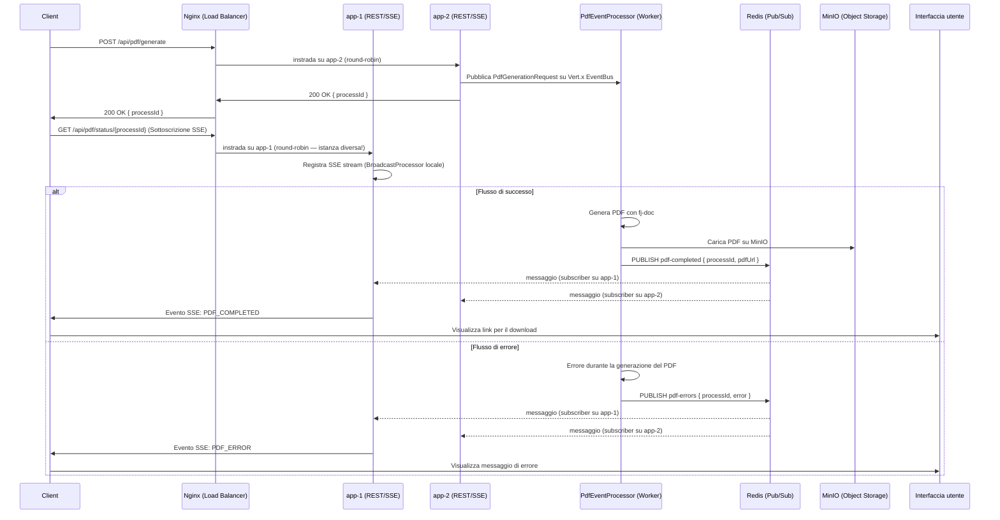

## Cronologia delle revisioni

| Versione | Data       | Autore          | Descrizione delle Modifiche                                                                                                                                                        |
|:---------|:-----------|:----------------|:-----------------------------------------------------------------------------------------------------------------------------------------------------------------------------------|
| 1.0.0    | 2025-06-21 | Antonio Musarra | Prima release                                                                                                                                                                      |
| 1.1.0    | 2025-06-22 | Antonio Musarra | Aggiunti i capitoli bonus, immagini e didascalie                                                                                                                                   |
| 1.2.0    | 2025-06-23 | Antonio Musarra | Aggiornamento per riflettere l'uso di MinIO, fj-doc e il nuovo formato degli eventi SSE                                                                                            |
| 1.3.0    | 2026-06-11 | Antonio Musarra | Evoluzione verso architettura distribuita: Redis Pub/Sub, pending-event buffer, fix race condition, resource leak, deploy Podman Compose                                           |
| 1.3.1    | 2026-06-12 | Antonio Musarra | Correzione: `downloadPdf` usava `Uni.createFrom().item()` in modo errato; sostituito con `@Blocking` per proteggere l'Event Loop. <br/>Aggiunta tabella comparativa Redis vs Kafka |

[TOC]

<div style="page-break-after: always; break-after: page;"></div>

## Introduzione

La gestione di task asincroni in un'applicazione web può essere una sfida, specialmente quando si tratta di operazioni che richiedono molto tempo, come la generazione di report o l'elaborazione di file. Una soluzione efficace per notificare lo stato di tali operazioni ai client è l'uso dei **Server-Sent Events (SSE)**. Questi eventi consentono al server di inviare aggiornamenti in tempo reale a un client, migliorando l'esperienza utente e la reattività dell'applicazione.

In questo articolo, analizzeremo un'applicazione Proof of Concept (PoC) che dimostra come utilizzare i Server-Sent Events (SSE) per notificare a un client lo stato di un processo asincrono di lunga durata, come la generazione di un PDF.
Esploreremo l'architettura, il codice sorgente e gli strumenti per testare la soluzione.
A differenza di una semplice simulazione, questa PoC genera realmente un file PDF utilizzando la libreria **fj-doc** e lo archivia su uno storage a oggetti **MinIO**.

L'architettura è stata evoluta per supportare lo **scaling orizzontale**: il componente `SseBroadcaster` non si basa più su una mappa in-memory locale, ma utilizza **Redis Pub/Sub** come canale di notifica cross-instance. In questo modo, qualsiasi istanza dell'applicazione può consegnare un evento SSE al client corretto, indipendentemente da quale istanza ha processato la richiesta di generazione PDF. È inoltre implementato un meccanismo di **pending-event buffer** su Redis per risolvere la race condition in cui Redis pubblica l'evento prima che il client SSE apra la connessione.


> **Bonus**: alla fine dell'articolo, troverai il link al progetto completo su GitHub, che include un'applicazione Quarkus funzionante con SSE e un client HTML per testare la funzionalità. Inoltre, sono inclusi test automatici con JUnit per garantire la qualità del codice e la corretta integrazione tra i componenti + una collection di Postman per testare il flusso end-to-end.


## Cosa sono i Server-Sent Events (SSE)?

I Server-Sent Events sono uno standard web che permette a un server di inviare aggiornamenti a un client in modo pro-attivo su una singola connessione HTTP. A differenza di WebSockets, la comunicazione è unidirezionale: solo dal server al client. Quali sono i vantaggi principali dei SSE?

- **Semplicità**: SSE si basa su HTTP/1.1 ed è più semplice da implementare sia lato client che server rispetto a WebSockets.
- **Efficienza**: evita overhead del polling continuo, dove il client deve chiedere ripetutamente al server se ci sono novità.
- **Standard Web**: è supportato nativamente dalla maggior parte dei browser moderni tramite l'oggetto EventSource.
- **Reconnect Automatica**: i client SSE gestiscono automaticamente la reconnect in caso di perdita del collegamento.


In questa PoC, SSE viene utilizzato per informare l'utente sullo stato di una richiesta di generazione di un PDF.

Il client avvia la richiesta, riceve un ID e si mette in ascolto su un canale SSE in attesa di ricevere la notifica di avvenuta generazione del PDF. Questo approccio consente di mantenere l'interfaccia utente reattiva e di evitare il blocco del thread principale durante operazioni potenzialmente lunghe.

<div style="page-break-after: always; break-after: page;"></div>

## Architettura e flusso dell'applicazione

L'architettura dell'applicazione è semplice ma efficace. Il client invia una richiesta al server per avviare la generazione del PDF. Il server risponde con un ID univoco per la richiesta e inizia il processo di generazione in background. Durante questo processo, il server invia aggiornamenti di stato tramite SSE al client, che poi deciderà come usare queste informazioni.

Il flusso dell'applicazione può essere riassunto come segue:


```mermaid
sequenceDiagram
   participant A as Client
   participant N as Nginx (Load Balancer)
   participant B1 as app-1 (REST/SSE)
   participant B2 as app-2 (REST/SSE)
   participant C as PdfEventProcessor (Worker)
   participant R as Redis (Pub/Sub)
   participant D as MinIO (Object Storage)
   participant E as Interfaccia utente

   A->>N: POST /api/pdf/generate
   N->>B2: instrada su app-2 (round-robin)
   B2->>C: Pubblica PdfGenerationRequest su Vert.x EventBus
   B2->>N: 200 OK { processId }
   N->>A: 200 OK { processId }

   A->>N: GET /api/pdf/status/{processId} (Sottoscrizione SSE)
   N->>B1: instrada su app-1 (round-robin — istanza diversa!)
   B1->>B1: Registra SSE stream (BroadcastProcessor locale)

   alt Flusso di successo
      C->>C: Genera PDF con fj-doc
      C->>D: Carica PDF su MinIO
      C->>R: PUBLISH pdf-completed { processId, pdfUrl }
      R-->>B1: messaggio (subscriber su app-1)
      R-->>B2: messaggio (subscriber su app-2)
      B1->>A: Evento SSE: PDF_COMPLETED
      A->>E: Visualizza link per il download
   else Flusso di errore
      C->>C: Errore durante la generazione del PDF
      C->>R: PUBLISH pdf-errors { processId, error }
      R-->>B1: messaggio (subscriber su app-1)
      R-->>B2: messaggio (subscriber su app-2)
      B1->>A: Evento SSE: PDF_ERROR
      A->>E: Visualizza messaggio di errore
   end
```

**Figura 1**: Flusso distribuito dell'applicazione con Redis Pub/Sub e Server-Sent Events

Quali sono i componenti principali di questa architettura?

- **Client**: invia la richiesta di generazione del PDF e si mette in ascolto per gli aggiornamenti via SSE.
- **Nginx**: funge da reverse proxy e load balancer round-robin; la configurazione SSE (`proxy_buffering off`, `proxy_read_timeout` elevato, `Connection ''`) è già inclusa.
- **PdfResource**: espone gli endpoint REST e SSE su ogni istanza dell'applicazione.
- **SseBroadcaster**: sottoscrive i canali Redis all'avvio; consegna gli eventi SSE ai client connessi localmente; implementa il **pending-event buffer** (Redis `SETEX`/`GETDEL`) per gestire la race condition.
- **PdfEventProcessor**: esegue la logica di generazione del PDF in background su un pool di thread dedicato usando la libreria `fj-doc`, carica il risultato su MinIO e pubblica l'esito su Redis Pub/Sub.
- **Redis**: canale Pub/Sub cross-instance. Memorizza anche gli eventi pendenti (TTL = 300 s) per i client SSE che si connettono in ritardo.
- **MinIO**: storage a oggetti S3-compatibile per i file PDF generati.

<div style="page-break-after: always; break-after: page;"></div>

Questa architettura consente di separare le responsabilità, mantenendo il codice pulito e facilmente manutenibile. Il server gestisce la logica di business, mentre il client si occupa della presentazione e dell'interazione con l'utente.

Questa PoC è stata realizzata utilizzando il framework cloud native Quarkus. Quali sono i componenti principali di Quarkus utilizzati in questa PoC?

- **Quarkus REST**: per gestire le richieste HTTP e le risposte usando il modello non bloccante e il supporto per SSE.
- **Quarkus Event Bus**: per gestire la comunicazione asincrona intra-JVM tra `PdfResource` e `PdfEventProcessor`.
- **Quarkus Mutiny**: per gestire la programmazione reattiva e le operazioni asincrone in modo semplice e intuitivo.
- **Quarkus MinIO Client**: per interagire con lo storage a oggetti MinIO e gestire il caricamento dei file PDF generati.
- **Quarkus Redis Client**: per il canale Pub/Sub cross-instance e il pending-event buffer; in modalità dev/test Quarkus Dev Services avvia automaticamente un container Redis.

<div style="page-break-after: always; break-after: page;"></div>

## Analisi del codice sorgente

Il backend dell'applicazione è costituito da due componenti principali:

1. Endpoint REST per avviare la generazione del PDF e restituire l'ID della richiesta.
2. Endpoint SSE per inviare aggiornamenti di stato al client.
3. Un componente che gestisce gli eventi SSE e le notifiche di completamento o errore della generazione del PDF.
4. Un componente che gestisce la logica di generazione del PDF e invia gli aggiornamenti di stato usando l'Event Bus di Quarkus.

### Endpoint REST

L'endpoint REST `/generate` è responsabile dell'avvio della generazione del PDF e della restituzione dell'ID della richiesta. A seguire l'implementazione di questo endpoint.

```java
@POST
@Path("/generate")
@Produces(MediaType.TEXT_PLAIN)
public Uni<String> generatePdf() {
    String processId = UUID.randomUUID().toString();
    Log.debugf("Starting the PDF generation for ID: %s", processId);

    // Pubblica una richiesta sull'event bus
    eventBus.publish(
        requestsDestination,
        new PdfGenerationRequest(processId),
        new DeliveryOptions().setCodecName(PdfGenerationRequestCodec.CODEC_NAME));

    Log.debugf("Request for PDF generation for ID %s sent to the event bus.", processId);

    return Uni.createFrom().item(processId);
}
```

**Source Code 1**: Implementazione dell'endpoint REST per la richiesta di generazione del PDF

Questo è un tipo di operazione non bloccante che restituisce un `Uni<String>`, per essere eseguita sul thread di I/O (event loop), garantendo così prestazioni elevate e scalabilità. Il metodo genera un ID univoco per la richiesta e pubblica un evento sull'Event Bus di Quarkus per avviare il processo di generazione del PDF.

L'endpoint `/download/{processId}` permette di scaricare il PDF generato dal servizio di storage S3 MinIO.
Quest'operazione esegue una chiamata di I/O bloccante (`minioClient.getObject(...)` usa il client MinIO sincrono/imperativo) e per questo motivo è annotata con **`@Blocking`**.

> **⚠️ Errore comune — `Uni.createFrom().item()` non protegge l'Event Loop**
>
> Un pattern che può trarre in inganno è il seguente:
> ```java
> // ❌ NON è sicuro: il lambda viene eseguito sul thread del subscriber,
> //    che in Quarkus REST è l'event loop thread!
> return Uni.createFrom().item(() -> { minioClient.getObject(...); ... });
> ```
> `Uni.createFrom().item()` **non** esegue il lambda su un worker thread. Lo esegue sul thread che si sottoscrive all'`Uni` (nel caso di un endpoint Quarkus REST, l'Vert.x event loop thread). Mettere una chiamata bloccante all'interno di questo blocco **congela ugualmente l'Event Loop**.
>
> Il log conferma il problema:
> ```
> DEBUG [PdfResource] (vert.x-eventloop-thread-3) PDF with key: … retrieved from MinIO
> ```
> La soluzione corretta è annotare il metodo con `@Blocking`, che istruisce Quarkus REST a eseguire l'intero metodo su un thread del **worker pool** di Vert.x, lasciando libero l'event loop.

<div style="page-break-after: always; break-after: page;"></div>

```java
@GET
@Path("/download/{processId}")
@Produces(MediaType.APPLICATION_OCTET_STREAM)
@Blocking  // minioClient.getObject() è bloccante — deve girare sul worker pool, NON sull'event loop
public Response downloadPdf(@PathParam("processId") String processId) {
    String objectKey = processId + ".pdf";
    try {
        InputStream stream = minioClient.getObject(
                GetObjectArgs.builder()
                        .bucket(bucketName)
                        .object(objectKey)
                        .build());

        Response.ResponseBuilder response = Response.ok(stream);
        response.header(HttpHeaders.CONTENT_DISPOSITION, "attachment;filename=" + objectKey);
        response.header(HttpHeaders.CONTENT_TYPE, MediaType.APPLICATION_OCTET_STREAM);
        return response.build();
    } catch (ErrorResponseException e) {
        if ("NoSuchKey".equals(e.errorResponse().code())) {
            Log.warnf("PDF with key: %s not found in MinIO bucket: %s", objectKey, bucketName);
            return Response.status(Response.Status.NOT_FOUND).build();
        }
        Log.errorf(e, "Failed to download PDF with key: %s from MinIO bucket: %s", objectKey, bucketName);
        return Response.serverError().entity(e.getMessage()).build();
    } catch (Exception e) {
        Log.errorf(e, "An unexpected error occurred while downloading PDF with key: %s", objectKey);
        return Response.serverError().entity(e.getMessage()).build();
    }
}
```

**Source Code 2**: Endpoint REST per il download del PDF — uso corretto di `@Blocking` per proteggere l'Event Loop


> **Approfondimento**: per saperne di più su Quarkus e il suo Event Bus, consulta la [documentazione ufficiale](https://quarkus.io/guides/reactive-event-bus).
> Per ulteriori approfondimenti sull'Event Bus, consiglio di leggere l'eBook [Quarkus Event Bus - Come sfruttarlo al massimo: utilizzi e vantaggi](https://bit.ly/3VTG2dt).

<div style="page-break-after: always; break-after: page;"></div>

### Endpoint SSE

L'endpoint SSE `/status/{id}` e di conseguenza il metodo `getPdfStatus`, è il cuore del meccanismo di notifica tramite Server-Sent Events (SSE). A seguire l'implementazione di questo endpoint.

```java
@GET
@Path("/status/{processId}")
@Produces(MediaType.SERVER_SENT_EVENTS)
public Multi<OutboundSseEvent> getPdfStatus(@PathParam("processId") String processId) {
   Log.debugf("The client requested status for ID: %s", processId);
   return sseBroadcaster.createStream(processId);
}
```

**Source Code 3**: Implementazione dell'endpoint SSE per gli aggiornamenti di stato del PDF

Lo scopo di questo metodo è di stabilire una connessione persistente tra il client (ad esempio, un browser) e il server. Attraverso questa connessione, il server può inviare aggiornamenti di stato (eventi) al client in modo proattivo, senza che il client debba continuamente interrogare il server (polling).

L'annotazione `@Produces(MediaType.SERVER_SENT_EVENTS)` indica che questo endpoint produrrà eventi SSE, che saranno inviati al client in formato `text/event-stream`, che è lo standard per le comunicazioni SSE. Dice a Quarkus e al client di trattare questa connessione come un flusso di eventi.

Il tipo di ritorno `Multi<OutboundSseEvent>` rappresenta un flusso di eventi (di zero o più elementi) che possono essere inviati al client.`Multi` è una parte del framework Mutiny di Quarkus, che consente di gestire flussi reattivi in modo semplice e intuitivo. In questo contesto, ogni `OutboundSseEvent` emesso dal `Multi` verrà inviato come un singolo evento SSE al client.

Il metodo `sseBroadcaster.createStream(processId)` crea un flusso di eventi SSE associato all'ID del processo specificato utilizzando il componente `SseBroadcaster` responsabile di:

1. Registrare l'interesse del client per quel `processId`.
2. Restituire un `Multi` a cui il client si "sottoscrive".
3. Quando un evento (come `PdfGenerationCompleted`) per quel `processId` viene ricevuto da un'altra parte dell'applicazione (ad esempio, dal worker), il `SseBroadcaster` lo invierà (`emit`) sul `Multi` appropriato, facendolo arrivare al client connesso.

In sintesi, quando un client chiama `GET /api/pdf/status/{processId}`, questo metodo apre un canale di comunicazione SSE e lo "sintonizza" per ricevere solo gli eventi relativi a quel `processId`, delegando tutta la gestione del flusso all'oggetto `SseBroadcaster`.

<div style="page-break-after: always; break-after: page;"></div>

#### SseBroadcaster con Redis Pub/Sub: architettura distribuita

L'implementazione attuale del `SseBroadcaster` utilizza **Redis Pub/Sub** come canale di notifica cross-instance, superando i limiti dell'approccio in-memory originale. Il componente si sottoscrive ai canali Redis all'avvio dell'applicazione e gestisce tre aspetti fondamentali:

1. **Consegna cross-instance**: quando `PdfEventProcessor` pubblica un evento su Redis, **tutte** le istanze dell'applicazione lo ricevono. L'istanza che ha la connessione SSE attiva per quel `processId` consegna l'evento al client.
2. **Pending-event buffer (fix race condition)**: se l'evento Redis arriva *prima* che il client SSE apra la connessione, il payload viene memorizzato in Redis con `SETEX pending:completed:{processId}` (TTL = 300 s). Quando `createStream()` viene invocato, `checkPendingEvents()` usa `GETDEL` (atomico, esattamente-una-consegna) per recuperare e consumare l'evento pendente.
3. **Prevenzione resource leak**: il `BroadcastProcessor` locale viene rimosso dalla mappa in tre scenari: disconnessione del client SSE (callback `onCancellation`), consegna dell'evento, shutdown dell'applicazione (`@Observes ShutdownEvent`).

```java
@ApplicationScoped
public class SseBroadcaster {

    static final String PENDING_COMPLETED_PREFIX = "pending:completed:";
    static final String PENDING_ERROR_PREFIX     = "pending:error:";
    static final long   PENDING_EVENT_TTL_SECONDS = 300L;

    // Mappa locale — scope intenzionalmente limitato alla singola JVM.
    // La consegna cross-instance è delegata a Redis Pub/Sub.
    private final Map<String, BroadcastProcessor<OutboundSseEvent>> processors =
            new ConcurrentHashMap<>();

    @Inject ReactiveRedisDataSource reactiveRedisDS;
    @Inject ObjectMapper objectMapper;
    @Inject Sse sse;

    private ReactivePubSubCommands.ReactiveRedisSubscriber redisChannelSubscriber;

    void onStart(@Observes StartupEvent ev) {
        ReactivePubSubCommands<String> redisPubSub = reactiveRedisDS.pubsub(String.class);
        redisPubSub.subscribe(
                List.of(completedChannel, errorsChannel),
                (channel, json) -> {
                    if (channel.equals(completedChannel)) onCompletedMessage(json);
                    else if (channel.equals(errorsChannel)) onErrorMessage(json);
                })
            .subscribe().with(
                sub -> { this.redisChannelSubscriber = sub; },
                err -> Log.errorf(err, "Failed to subscribe to Redis channels"));
    }

    void onShutdown(@Observes ShutdownEvent ev) {
        processors.forEach((id, p) -> p.onComplete());
        processors.clear();
        if (redisChannelSubscriber != null) {
            redisChannelSubscriber.unsubscribe().subscribe().with(v -> {}, err -> {});
        }
    }

    public Multi<OutboundSseEvent> createStream(String processId) {
        BroadcastProcessor<OutboundSseEvent> processor =
                processors.computeIfAbsent(processId, id -> BroadcastProcessor.create());

        // Controlla Redis per un evento arrivato prima dell'apertura dello stream SSE.
        checkPendingEvents(processId);

        return processor.onCancellation().invoke(() -> processors.remove(processId));
    }

    private void checkPendingEvents(String processId) {
        ReactiveValueCommands<String, String> values = reactiveRedisDS.value(String.class);
        // GETDEL: atomico — impedisce la doppia consegna in caso di chiamate concorrenti.
        values.getdel(PENDING_COMPLETED_PREFIX + processId)
            .subscribe().with(
                json -> {
                    if (json != null) onCompletedMessage(json);
                    else values.getdel(PENDING_ERROR_PREFIX + processId)
                            .subscribe().with(
                                errJson -> { if (errJson != null) onErrorMessage(errJson); },
                                err -> Log.error("Failed to check pending:error for: " + processId, err));
                },
                err -> Log.error("Failed to check pending:completed for: " + processId, err));
    }

    private void handleCompletionEvent(PdfGenerationCompleted event, String rawJson) {
        BroadcastProcessor<OutboundSseEvent> processor = processors.get(event.processId());
        if (processor != null) {
            OutboundSseEvent sseEvent = sse.newEventBuilder()
                    .name("PDF_COMPLETED").data(event)
                    .mediaType(MediaType.APPLICATION_JSON_TYPE).build();
            processor.onNext(sseEvent);
            processor.onComplete();
            processors.remove(event.processId());
        } else {
            // Nessun client SSE locale — buffer su Redis per connessioni in ritardo.
            reactiveRedisDS.value(String.class)
                .setex(PENDING_COMPLETED_PREFIX + event.processId(),
                       PENDING_EVENT_TTL_SECONDS, rawJson)
                .subscribe().with(v -> {}, err -> Log.errorf(err, "Failed to store pending event"));
        }
    }
    // ... handleErrorEvent è analogo
}
```

**Source Code 4**: `SseBroadcaster` con Redis Pub/Sub, pending-event buffer e cleanup lifecycle

Come funziona il flusso completo:

1. **Avvio** (`@Observes StartupEvent`): il `SseBroadcaster` si sottoscrive ai canali Redis `completedChannel` e `errorsChannel`.
2. **Apertura stream SSE** (`createStream`): viene registrato un `BroadcastProcessor` locale e viene immediatamente verificato Redis per eventuali eventi pendenti (race-condition guard).
3. **Ricezione evento Redis**: se esiste un processor locale per quel `processId`, l'evento viene consegnato al client SSE e il processor viene rimosso. In caso contrario l'evento viene memorizzato in Redis con TTL = 300 s.
4. **Shutdown** (`@Observes ShutdownEvent`): tutti i processor attivi vengono completati e la sottoscrizione Redis viene annullata.

<div style="page-break-after: always; break-after: page;"></div>

### Gestione della sottoscrizione e degli aggiornamenti di stato

La responsabilità di sottoscrivere i canali Redis e di inviare le notifiche SSE ai client è stata assegnata al componente dedicato `SseBroadcaster`, descritto nel dettaglio nella sezione precedente. La struttura ad alto livello è la seguente:

- All'avvio (`@Observes StartupEvent`) viene stabilita la sottoscrizione ai canali Redis.
- `createStream(processId)` registra il `BroadcastProcessor` e verifica immediatamente Redis per eventi pendenti.
- Gli handler `onCompletedMessage` / `onErrorMessage` deserializzano il payload JSON e delegano rispettivamente a `handleCompletionEvent` / `handleErrorEvent`.
- Allo shutdown (`@Observes ShutdownEvent`) tutti i processor attivi vengono completati e la sottoscrizione Redis viene annullata.

Questo design garantisce che le istanze dell'applicazione siano **stateless rispetto alle sessioni SSE**: la mappa `processors` è locale alla JVM, ma la consegna cross-instance è garantita da Redis.

<div style="page-break-after: always; break-after: page;"></div>

## Il servizio di generazione del PDF

Il ruolo del `PdfEventProcessor` è quello di un worker asincrono, completamente disaccoppiato dall'endpoint REST. Si occupa di eseguire l'attività di generazione del PDF, che può richiedere tempo, e di caricare il risultato su uno storage a oggetti. Questo disaccoppiamento è fondamentale per garantire che l'endpoint REST rimanga reattivo e non blocchi il thread di I/O.

Vediamo quali sono le principali responsabilità del `PdfEventProcessor`:

- **Ascolto delle Richieste**: si registra programmaticamente sull'event bus all'avvio dell'applicazione per consumare i messaggi di tipo `PdfGenerationRequest`.
- **Esecuzione Asincrona**: utilizza un `CompletableFuture` e un `ScheduledExecutorService` dedicato per eseguire la logica bloccante (generazione PDF e upload su MinIO) al di fuori del thread di I/O, garantendo che l'event loop non venga mai bloccato.
- **Generazione e Archiviazione Reale**: utilizza la libreria `fj-doc` per creare il documento PDF e il client MinIO per caricarlo nello storage a oggetti.
- **Notifica del Risultato**: una volta che il task è completato (con successo o con errore), pubblica un evento (`PdfGenerationCompleted` o `PdfGenerationError`) sull'event bus, che verrà poi inoltrato al client corretto dal `SseBroadcaster`.

### Analisi del codice

Il processore viene inizializzato all'avvio dell'applicazione (`onStart`), dove imposta il consumer dell'event bus e inizializza il publisher Redis. Il metodo `handlePdfGenerationRequest` gestisce la richiesta in modo non bloccante, delegando il lavoro pesante a un `CompletableFuture`.

```java
@Unremovable
@ApplicationScoped
public class PdfEventProcessor {

    // ... (campi, costruttore e metodo onStart)

    private void handlePdfGenerationRequest(Message<PdfGenerationRequest> message) {
        PdfGenerationRequest request = message.body();
        Log.debugf("Received PDF generation request with ID: %s", request.processId());

        generatePdfAsync(request.processId())
            .thenAccept(objectKey -> {
                String downloadUrl = String.format("/api/pdf/download/%s", request.processId());
                PdfGenerationCompleted completionEvent =
                        new PdfGenerationCompleted(request.processId(), downloadUrl);

                Log.debugf("Attempting to send PDF completion notification for ID: %s", request.processId());
                // Pubblica su Redis — tutte le istanze sottoscritte riceveranno il messaggio.
                publishToRedis(completedDestination, completionEvent);
                Log.debugf("PDF completion notification sent for ID: %s", request.processId());
            })
            .exceptionally(ex -> {
                PdfGenerationError errorEvent = new PdfGenerationError(
                        request.processId(), "Failed to process PDF generation: " + ex.getCause().getMessage());
                publishToRedis(errorsDestination, errorEvent);
                return null;
            });
    }

    /**
     * Serializza l'evento in JSON e lo pubblica sul canale Redis specificato.
     * Il numero di subscriber che ricevono il messaggio viene loggato.
     */
    private void publishToRedis(String channel, Object event) {
        try {
            String json = objectMapper.writeValueAsString(event);
            redisPublisher.publish(channel, json)
                .subscribe().with(
                    count -> Log.debugf("Published event to Redis channel '%s' (%d receivers)", channel, count),
                    err -> Log.errorf(err, "Failed to publish event to Redis channel: '%s'", channel));
        } catch (JsonProcessingException e) {
            Log.errorf(e, "Failed to serialize event for Redis channel: '%s'", channel);
        }
    }

    private CompletableFuture<String> generatePdfAsync(String processId) {
        long delay = ThreadLocalRandom.current().nextLong(minDelayInSeconds, maxDelayInSeconds + 1);
        Log.debugf("Scheduling PDF generation for process ID: %s with a delay of %d seconds", processId, delay);

        return CompletableFuture.supplyAsync(() -> {
            String objectKey = processId + ".pdf";
            try (ByteArrayOutputStream baos = new ByteArrayOutputStream()) {
                DocProcessContext context = DocProcessContext.newContext("processId", processId);
                docHelper.getDocProcessConfig().fullProcess("document", context, DocConfig.TYPE_PDF, baos);

                byte[] pdfBytes = baos.toByteArray();
                minioClient.putObject(
                        PutObjectArgs.builder()
                                .bucket(bucketName).object(objectKey)
                                .stream(new ByteArrayInputStream(pdfBytes), pdfBytes.length, -1)
                                .contentType(MediaType.APPLICATION_OCTET_STREAM)
                                .build());

                Log.debugf("PDF successfully generated and uploaded to MinIO with key: %s", objectKey);
                return objectKey;
            } catch (Exception e) {
                throw new CompletionException(e);
            }
        }, CompletableFuture.delayedExecutor(delay, TimeUnit.SECONDS, executor));
    }
}
```
**Source Code 5**: `PdfEventProcessor` — generazione PDF, upload MinIO e pubblicazione su Redis Pub/Sub

<div style="page-break-after: always; break-after: page;"></div>

Il flusso operativo è il seguente:

1. **Consumo dell'Evento**: il metodo `handlePdfGenerationRequest` viene invocato quando un messaggio `PdfGenerationRequest` arriva sull'event bus.
2. **Avvio Task Asincrono**: il metodo chiama immediatamente `generatePdfAsync`, che restituisce un `CompletableFuture`. Questo permette al gestore dell'evento di terminare subito, senza bloccare il thread dell'event loop.
3. **Elaborazione in Background**: `generatePdfAsync` usa `CompletableFuture.supplyAsync` per eseguire il codice di generazione e upload su un thread di un pool dedicato (`executor`). Qui avvengono le operazioni bloccanti.
4. **Notifica tramite Callback**: al `CompletableFuture` sono collegate delle callback:
   - `thenAccept` viene eseguita in caso di successo e pubblica l'evento `PdfGenerationCompleted`.
   - `exceptionally` viene eseguita in caso di errore e pubblica l'evento `PdfGenerationError`.

Questo pattern garantisce un'esecuzione efficiente e non bloccante, sfruttando appieno le capacità di programmazione asincrona di Java e Quarkus.

<div style="page-break-after: always; break-after: page;"></div>

## Test dell'applicazione con JUnit e client HTML

Per garantire la qualità e l'affidabilità dell'applicazione, sono stati implementati test automatici utilizzando JUnit e il framework di test di Quarkus. Questi test verificano il corretto funzionamento degli endpoint REST e SSE, assicurando che l'applicazione risponda come previsto.

I test di integrazione coprono l'intero flusso: dalla richiesta di generazione del PDF, alla sottoscrizione SSE, fino alla ricezione dell'evento di completamento, verificando che tutti i componenti (`PdfResource`, `SseBroadcaster`, `PdfEventProcessor`) interagiscano correttamente.

A seguire lo screenshot della DevUI di Quarkus che mostra i test JUnit eseguiti con successo.


**Figura 2**: Quarkus DevUI - Test JUnit eseguiti con successo

Il progetto include anche una semplice pagina HTML per testare l'applicazione in modo manuale. Questa pagina consente di inviare una richiesta di generazione del PDF e di visualizzare gli aggiornamenti di stato in tempo reale.

Il file `src/main/resources/templates/pub/pdf-generator.html` contiene il codice JavaScript per interagire con il backend.

1. Click sul bottone "Generate PDF": viene inviata una richiesta POST a `/api/pdf/generate`.
2. Ricezione del `processId`: una volta ottenuto l'ID, il client lo usa per costruire l'URL dell'endpoint SSE.
3. Creazione dell'`EventSource`: viene istanziato un nuovo oggetto `EventSource` che apre una connessione persistente a `/api/pdf/status/{processId}`.
4. Gestione degli eventi: vengono registrati listener specifici per gli eventi inviati dal server:
    - `eventSource.addEventListener('PDF_COMPLETED', ...)`: questo handler viene invocato quando il server invia l'evento di completamento. Il payload dell'evento, un oggetto JSON contenente l'URL per il download, viene estratto da `event.data`. A questo punto, viene mostrato il link per il download e la connessione SSE viene chiusa (`eventSource.close()`).
    - `eventSource.addEventListener('PDF_ERROR', ...)`: gestisce eventuali errori di generazione segnalati dal server.
    - `eventSource.onerror`: gestisce eventuali errori di connessione.

```javascript
// ...
.then(processId => {
    appendToLog(`Request sent successfully. Process ID: ${processId}`);
    const eventSource = new EventSource(`/api/pdf/status/${processId}`);

    eventSource.addEventListener('PDF_COMPLETED', function(event) {
        const data = JSON.parse(event.data);
        appendToLog(`PDF generation completed. Download available at: ${data.pdfUrl}`);
        showDownloadLink(data.pdfUrl);
        eventSource.close();
    });

    eventSource.addEventListener('PDF_ERROR', function(event) {
        const data = JSON.parse(event.data);
        appendToLog(`ERROR: ${data.errorMessage}`);
        eventSource.close();
    });

    eventSource.onerror = function(err) {
        appendToLog('EventSource connection error.');
        eventSource.close();
    };
});
```

**Source Code 6**: Gestione degli eventi SSE nominati nel client HTML

A seguire uno screenshot della pagina HTML in esecuzione, che mostra il flusso di generazione del PDF e la ricezione degli aggiornamenti di stato tramite SSE.


**Figura 3**: Client HTML - Generazione PDF con SSE

Dai log della console dell'applicazione, possiamo vedere il flusso di esecuzione mostrato nel diagramma di sequenza. A seguire un esempio di log generato a fronte della richiesta di generazione del PDF eseguita dal client HTML.

```plaintext
2025-06-23 11:30:10,100 DEBUG [PdfResource] (vert.x-eventloop-thread-1) Starting the PDF generation for ID: a1b2c3d4-…
2025-06-23 11:30:10,105 DEBUG [PdfResource] (vert.x-eventloop-thread-1) Request sent to the event bus.
2025-06-23 11:30:10,110 DEBUG [PdfEventProcessor] (vert.x-eventloop-thread-0) Received PDF generation request with ID: a1b2c3d4-…
2025-06-23 11:30:10,112 DEBUG [PdfEventProcessor] (vert.x-eventloop-thread-0) Scheduling PDF generation with a delay of 25 seconds
2025-06-23 11:30:10,115 DEBUG [PdfResource] (vert.x-eventloop-thread-2) The client requested status for ID: a1b2c3d4-…
2025-06-23 11:30:10,118 DEBUG [SseBroadcaster] (vert.x-eventloop-thread-2) Creating SSE stream for processId: a1b2c3d4-…
2025-06-23 11:30:35,500 DEBUG [PdfEventProcessor] (pool-5-thread-1) PDF successfully generated and uploaded to MinIO with key: a1b2c3d4-….pdf
2025-06-23 11:30:35,505 DEBUG [PdfEventProcessor] (pool-5-thread-1) Attempting to send PDF completion notification for ID: a1b2c3d4-…
2025-06-23 11:30:35,510 DEBUG [PdfEventProcessor] (pool-5-thread-1) PDF completion notification sent for ID: a1b2c3d4-…
2025-06-23 11:30:35,512 DEBUG [PdfEventProcessor] (vert.x-eventloop-thread-1) Published event to Redis channel 'custom-pdf-completed-destination' (1 receivers)
2025-06-23 11:30:35,515 DEBUG [SseBroadcaster] (vert.x-eventloop-thread-0) Sending PDF_COMPLETED event for processId: a1b2c3d4-…
2025-06-23 11:30:35,520 DEBUG [SseBroadcaster] (vert.x-eventloop-thread-0) Removed SSE processor for processId: a1b2c3d4-…
```

**Console 1**: Log generato durante la generazione del PDF (singola istanza)

Dal log è possibile notare l'uso dell'event loop di Vert.x (`vert.x-eventloop-thread-*`) per le operazioni non bloccanti (gestione richieste HTTP, eventi) e di un thread del pool dedicato (`pool-5-thread-1`) per l'esecuzione della generazione del PDF, che è un'operazione bloccante.

<div style="page-break-after: always; break-after: page;"></div>

## Flusso cross-instance: caso reale dai log

Lo scenario più interessante si verifica quando Nginx (round-robin) instrada la richiesta `POST /api/pdf/generate` e la richiesta `GET /api/pdf/status/{processId}` su **istanze diverse**. A seguire un esempio reale di log prodotto con due istanze (`app-1` e `app-2`) in esecuzione dietro Nginx.

```plaintext
sse-poc-app-2 | 13:27:25,313 DEBUG [PdfResource] Starting the PDF generation for ID: 7f390554-…
sse-poc-app-2 | 13:27:25,320 DEBUG [PdfResource] Request sent to the event bus.
sse-poc-app-2 | 13:27:25,322 DEBUG [PdfEventProcessor] Received PDF generation request with ID: 7f390554-…
sse-poc-app-2 | 13:27:25,322 DEBUG [PdfEventProcessor] Scheduling PDF generation with a delay of 5 seconds
sse-poc-nginx | POST /api/pdf/generate 200 — upstream=10.89.0.9:8080  ← app-2

sse-poc-app-1 | 13:27:25,338 DEBUG [PdfResource] The client requested status for ID: 7f390554-…
sse-poc-app-1 | 13:27:25,339 DEBUG [SseBroadcaster] Creating SSE stream for processId: 7f390554-…
                                                    ↑ istanza diversa dall'elaborazione!

sse-poc-app-2 | 13:27:30,735 DEBUG [PdfEventProcessor] PDF successfully generated and uploaded to MinIO
sse-poc-app-2 | 13:27:30,736 DEBUG [PdfEventProcessor] PDF completion notification sent for ID: 7f390554-…
sse-poc-app-2 | 13:27:30,738 DEBUG [PdfEventProcessor] Published event to Redis channel 'custom-pdf-completed-destination'

sse-poc-app-1 | 13:27:30,737 DEBUG [SseBroadcaster] Sending PDF_COMPLETED event for processId: 7f390554-…
                                                    ↑ app-1 riceve da Redis e consegna al client ✅
sse-poc-app-2 | 13:27:30,738 DEBUG [SseBroadcaster] No active SSE processor for processId: 7f390554-… — buffering completed event in Redis (TTL=300s)
                                                    ↑ app-2 non ha il processor locale → buffer difensivo ⚠️
sse-poc-app-1 | 13:27:30,749 DEBUG [SseBroadcaster] Removed SSE processor for processId: 7f390554-…
sse-poc-nginx | GET /api/pdf/status/7f390554-… 200 — upstream=10.89.0.8:8080  ← app-1
```

**Console 1**: Log cross-instance — POST su app-2, SSE su app-1

Il diagramma di sequenza PlantUML completo per questo scenario è disponibile in `src/docs/blog/article/resources/diagrams/cross-instance-async-flow.puml` e visualizzabile con [PlantUML Editor (online)](https://editor.plantuml.com/uml/vLdDRkF84RxpAMgrXx64aQmVUsmhSB1ZMPunnZ-Af0qIn4RG8fjIGrGtjvkqBEmFvf9S4sJt5EIGKvuXp-CNo2kagacAf6JFxbvs3zACCMEfgjXTNTzNNxM-C17JKRm8mDNAcBgG-8PqUPsPbNJhVg2Mpgkd7pxko5_d5VmkPdeU6nYD-Z1GFNZw-0FqR6ukqzp0MyeDNDZSeCV8vP9feRfmCnNo4VQqYgLNrseYP1NmbuWR6DoEni2a1-_wOnixKd1-UN7H7_Plnf2btJGm7YJ6-omK-w7dxq-vv9f57E3fh_y05eRrDi1UgzauFcaq6oVTu-PnishzA7RkXo6ZsEm_VVnFxjagU1vddkXxEp5SFt0F0ZM5I2muEYz2q4nEUHTQdMxxgDi-n6Hyd_xIQSBUb-CUFNUW5QxSmELv5uxypadpyF2W_iPbxVe1Pxm-yLpyd-jotkhuxCGxmYMmoKJp1u6RykpIChVgJXMR4uaeu3-lukxadgsEl1I-iOucqfmjydEkEewP2naoZUyQ_bNCCSvRhTLoF1FkNDA1jHg7pnYzmueDpvJsk2wOFcDu9NpyaJonxQb0QVZyqBwUiHuWpmXNX4n69OUEVVs80tFdKukgrEdYcFuKdAIAokjuQr-R5bjnwDLq7EP6-6logfnXaX0DcEbU8BYCgXLOlvY1dkDCr2DKBDZH20kPQyCXrEfn1VjmTOOEd_Vx5mSN5mv0c6yZzIc4AmM-SJZo0yPE7_02qYjssGVz_cRmWUSFkL6nTdbbA_XWsDwq_ptNKUCH-W-unxFOb7VPFzkon_ZMDiMxqfLY_FvWos5aEEQIUIupaSsdtH6bar6runFA6xwKlaPJ7RjHh3djiscFPoFijP2NjoybyNhJUiWzOGWryMH_54yAXudMmsTI_Wn5ldYUp-wmbU-mzJFFg9MlvnNywWJr2z7WwIdygNKFW_CBU9UqEg4a38a6J4I7aNQVHgVLgSBfwGwbnka1r7yBS8C5qdr15ZZ4RA35T1Q1yf558DKXgV90eL6hMUJLQlXPKPr072Pz0rlyXfoWEgJ0ZdEJB049vEKb87-A1v8eH3CEcQ9Buh5MBs526vVUdQpLieQFIqgjYN7GF8mdWJ0pGA3anP3M0k9h7UGqbmmsG9gbBkwrtMp2xOTQ3RxEdmdVEXulhvBsHLwzJtevj2oxVoGuDFHu893ldrrV8Gt4XjQ3yf1u6dV6lHZxFHNwTEsBcyAOR0MdS0Yckd6QrZVd-oqA9dQPundFE4JCpD44eSDWgVGS5ndDy70z29KA6kITU0avXQK8KFAhHHXmVDntcQPh5CvzTr161DI-jp9gbCYe8PyAH4R2H4K6wXplD0FHWB4vNvJ0_5EvgFLJk2WRKC1AOa_uFjTO_Ejf2Noj5hRsYPO-UuwpMYyiEbjoaRbQn5mjwqYj6prTN4_4avhOombdxMCxlBL5fzH7sz91y5t7GIJw2n5PPO0R39JBWenSb3QmO26YVyu9-tdqZNZ86kvyW5j3s5hictmbTvBqFcvvHfWMr3HHxC2AH-bMC4noS0c_OOKZmUr5_37QvnIhdgJyDJubbdFkLSiisLgpPAyS9HitLCYHp77g-3iicOXe5JwIaerjSF3SDHRf93AcGBGPUI2t7dKEaqf6deS0CwntZKkoZWZNL4rn6A1qfeGbACXl3ng8rAg3HhRsqlvPgwKErALthR0ExbDifsCCtAX8-C8jToXRP6-UFdv_j7jzQbrRGokLlpoxkXoznw9nOnEfHHqhgfxf7Q_keLeJqYQlLhkJ1ScN5-5hsAf9r8EVb6TNQjg5YenHMsdkSXAAE5OJv9F3ivUgW5qWc32Nn9hcEEbA0-Jo6q3cZR53f19pXVfC-a8lk8UMarLwVsVYYN6rc627sJESmuG7Qbaj2hSYXPCETOOfaDAEii2DiYdFbkXbOolW2jVHiHKKtDelkxN9ZGL6bNntgF88deViFZqUEcngaBPLmtbsb2M47kqQDZSaJQ3KF0wtb11fcLfj_Iug2HI7g2v8KMGeXAT__IKDjvxTADrMSNJlPF8lXi6kykVUxVNWgZ_kdnF6FHQnRd6uUmqB8ONwWF8hXNN0VOlg7k8jlGHCpd5aBsm0mSWDViQWKWfVMMF3Ffv6BLeJmbTornAqooI2SubW1JTGXdj5l6vaHyaUYTiWOAbhmXP9VZHVg0SEnIJboIaYtqhJ7QenYyB9VNedJYWyvpwN1k47Pp5D3ZXjC9TZ4q0fRJCxZPdsgcLexbpRjEIUa_mdeIbL_i4MBl_vx__zzsyRxT46pTjZSZQ4KGqpPUZB7nhUyda2RIWeZZCcnsa3u38Y165ic2EAq6evu-YfKyvb0LrphBB6YM55j06mWZGO8MJ_G4IJp5JTjIhevdCiIGABPGZPoehERm76uoiSr3eu0PcDVGxNtoH0eUmcjkow8FprDbtxXG9QpJ3apUsOHhMC9pWo4jb9dCuiwj4Cv-NI35gbwvstDtzSZy2K2nK77WKnyO8dkNiGZARUy_uLx35KFyAj4YcznzpOHoHRMpApdRgYrA1J9tEQKEs5aH6OgXNmnn2Pa0xKfq7NPWGDeXdcErk8BXx0i2GaQZLxpsO7NzHcUWVrmflIRLFFjeGI4HsSx1eHbIuQte_7W_rMevNSE52n52uTaWvQlPFPZT5f-SB8SRx0qeiNWUFy7m00]) o con il plugin PlantUML per IDE. 

> **Nota sul buffer difensivo su app-2**: poiché entrambe le istanze sono sottoscritte allo stesso canale Redis, `app-2` riceve anch'essa l'evento ma non ha un processor attivo per quel `processId`. Esegue quindi il buffer su Redis come protezione contro la race condition. In questo caso specifico l'evento è già stato consegnato da `app-1`, quindi la chiave Redis scadrà dopo 300 s senza consumatori — comportamento corretto e atteso.

<div style="page-break-after: always; break-after: page;"></div>

## Test dell'applicazione con Postman

All'interno di questa PoC, è stata inclusa una collection di Postman nel file `src/main/postman/collection/postman_collection.json`. Questa collection permette di testare facilmente il flusso end-to-end.

La collection contiene due richieste da eseguire in sequenza:

1. **Generate PDF**
   - **Azione**: Esegue una richiesta `POST` all'endpoint `/api/pdf/generate`.
   - **Scopo**: Avvia il processo di generazione asincrona del PDF. Il server risponde immediatamente con un ID di processo univoco (UUID).
   - **Automazione**: Lo script nella tab "Tests" di questa richiesta cattura automaticamente l'ID di processo dalla risposta e lo salva in una variabile di collezione (`processId`) per utilizzarlo nel passo successivo.

2. **Get PDF Status (SSE)**
   - **Azione**: Esegue una richiesta `GET` all'endpoint `/api/pdf/status/{{processId}}`.
   - **Scopo**: Utilizza l'ID salvato in precedenza per aprire una connessione Server-Sent Events e mettersi in ascolto degli aggiornamenti di stato.
   - **Risultato Atteso**: Postman manterrà la connessione aperta. Dopo il ritardo gestito dal `PdfEventProcessor`, il server invierà un evento nominato `PDF_COMPLETED`. Postman visualizzerà la notifica ricevuta, che sarà simile a:
     
      ```
      event: PDF_COMPLETED
      data: {"processId":"xxxxxxxx-xxxx-xxxx-xxxx-xxxxxxxxxxxx","pdfUrl":"/api/pdf/download/xxxxxxxx-xxxx-xxxx-xxxx-xxxxxxxxxxxx"}
      ```
      
   - **Automazione**: Gli script di test associati verificano che la risposta contenga l'evento `PDF_COMPLETED` e che il payload JSON contenga un `pdfUrl` valido.

A seguire uno screenshot di Postman che mostra l'esecuzione della richiesta SSE e la ricezione dell'evento di completamento.


**Figura 4**: Esecuzione del test SSE con Postman

<div style="page-break-after: always; break-after: page;"></div>

## Deploy con Podman Compose

Per eseguire lo stack completo in un ambiente containerizzato, il progetto include un file `docker-compose.yml` in `src/main/docker/`, compatibile con **Podman Compose** (≥ 1.0) e con il comando built-in `podman compose` (Podman ≥ 4.7).

Lo stack comprende sei servizi:

| Servizio     | Immagine                              | Ruolo                                                 |
|:-------------|:--------------------------------------|:------------------------------------------------------|
| `redis`      | `redis:7-alpine`                      | Canale Pub/Sub cross-instance                         |
| `minio`      | `minio/minio:latest`                  | Object storage per i PDF generati                     |
| `minio-init` | `minio/mc:latest`                     | Init one-shot: crea il bucket `pdf-bucket`            |
| `app-1`      | `quarkus/quarkus-sse-poc-jvm:latest`  | Istanza Quarkus 1                                     |
| `app-2`      | `quarkus/quarkus-sse-poc-jvm:latest`  | Istanza Quarkus 2                                     |
| `nginx`      | `nginx:1.27-alpine`                   | Reverse proxy / load balancer (entry point → :8080)   |

La configurazione Nginx in `src/main/docker/nginx/nginx.conf` include le impostazioni specifiche per SSE:

```nginx
location /pdf/status {
    proxy_pass         http://quarkus_app;
    proxy_http_version 1.1;
    proxy_set_header   Connection        '';   # keep-alive upstream
    proxy_buffering             off;           # flush immediato degli eventi SSE
    proxy_cache                 off;
    proxy_read_timeout          3600s;         # mantieni lo stream aperto fino a 1 ora
    add_header X-Accel-Buffering no;
}
```

**Source Code 7**: Configurazione Nginx ottimizzata per SSE

### Quick start con Podman

```shell
# 1. (Prima volta) Inizializza e avvia la Podman Machine
podman machine init && podman machine start

# 2. Build del JAR
./mvnw package -DskipTests

# 3. Build dell'immagine container
podman build -f src/main/docker/Dockerfile.jvm \
             -t quarkus/quarkus-sse-poc-jvm:latest .

# 4. Avvio dello stack completo
podman compose -f src/main/docker/docker-compose.yml up -d

# Applicazione  → http://localhost:8080
# MinIO console → http://localhost:8080/minio-console/
# MinIO API     → http://localhost:9000
```

> **Nota rootless Podman**: La porta Nginx di default è `8080` (configurabile in `src/main/docker/.env`) perché i container rootless non possono bindare porte < 1024. Modificare `NGINX_HTTP_PORT=80` solo quando si esegue come root o si configura `net.ipv4.ip_unprivileged_port_start ≤ 80`.

<div style="page-break-after: always; break-after: page;"></div>

## Conclusioni

Questa Proof of Concept (PoC) dimostra in modo efficace come implementare un sistema robusto e **scalabile orizzontalmente** per la gestione di task asincroni in un'applicazione Quarkus. Sfruttando i Server-Sent Events (SSE), **Redis Pub/Sub**, l'Event Bus di Vert.x e la programmazione asincrona, abbiamo costruito un flusso distribuito completo che notifica un client in tempo reale indipendentemente dall'istanza che ha processato la richiesta.

L'architettura presentata si basa su una chiara **separazione delle responsabilità**:

- **`PdfResource`**: gestisce l'esposizione degli endpoint REST e SSE, agendo come punto di ingresso.
- **`SseBroadcaster`**: si sottoscrive ai canali Redis all'avvio; consegna gli eventi SSE ai client connessi localmente; implementa il **pending-event buffer** (Redis `SETEX`/`GETDEL`, TTL = 300 s) per risolvere la race condition in cui Redis pubblica prima che il client SSE apra la connessione.
- **`PdfEventProcessor`**: orchestra il lavoro pesante in background, eseguendo la generazione del PDF con `fj-doc` e l'upload su MinIO in modo completamente asincrono tramite `CompletableFuture` su un pool di thread dedicato; pubblica l'esito su Redis Pub/Sub.

Le evoluzioni rispetto alla versione originale sono:

| Aspetto                                        | Versione iniziale                     | Versione attuale                                 |
|:-----------------------------------------------|:--------------------------------------|:-------------------------------------------------|
| Notifiche                                      | Vert.x EventBus in-memory (intra-JVM) | Redis Pub/Sub (cross-instance)                   |
| Scaling orizzontale                            | ❌ Non supportato                      | ✅ Nessuna sticky session necessaria              |
| Race condition (evento prima dello stream SSE) | ❌ Evento perso                        | ✅ Pending-event buffer su Redis                  |
| Resource leak (client disconnect)              | ⚠️ Rischio                            | ✅ Cleanup via `onCancellation` + `ShutdownEvent` |
| Deploy multi-istanza                           | Manuale                               | ✅ Podman Compose (6 servizi)                     |

Il modello implementato è flessibile e può essere facilmente esteso per comunicare stati intermedi (es. `GENERATION_STARTED`, `UPLOADING_TO_STORAGE`) o scalato ulteriormente aggiungendo nuove istanze senza alcuna modifica al codice — è sufficiente aggiornare il file `docker-compose.yml`.

In sintesi, la combinazione delle funzionalità reattive di Quarkus con Redis Pub/Sub e i pattern di concorrenza di Java offre un toolkit potente per costruire applicazioni moderne, resilienti e performanti, in grado di offrire un'eccellente esperienza utente anche in scenari di produzione distribuiti.

### Perché Redis Pub/Sub e non Kafka (o RabbitMQ)?

Nella fase di design è stato valutato anche l'uso di **Apache Kafka**, spesso citato come soluzione di riferimento per la messaggistica distribuita. La scelta è ricaduta su Redis Pub/Sub per ragioni precise legate alla natura del caso d'uso.

| Criterio | Redis Pub/Sub | Apache Kafka |
|:---------|:--------------|:-------------|
| **Modello di consegna** | Fan-out: **tutti** i subscriber ricevono ogni messaggio | Consumer group: **un solo** consumer per gruppo riceve ogni messaggio |
| **Persistenza** | Nessuna (fire-and-forget); buffer temporaneo via `SETEX` (TTL) | Log persistente su disco, retention configurabile |
| **Latenza** | Sub-millisecondo | Decine di millisecondi (batching + fsync) |
| **Complessità operativa** | Singolo processo, zero configurazione aggiuntiva | Broker, topic, partizioni, offset, consumer group, KRaft/ZooKeeper |
| **Quarkus Dev Services** | Container Redis avviato automaticamente con una dipendenza | Container Kafka disponibile, ma più pesante in dev |
| **Message replay** | Non supportato | Supportato (rilettura da offset) |

Il punto più rilevante è il **modello di consegna**. In questo caso d'uso occorre che il messaggio di completamento del PDF arrivi a **tutte** le istanze dell'applicazione, perché non è possibile sapere a priori quale istanza ospita la connessione SSE del client. Redis Pub/Sub realizza esattamente questo pattern (fan-out), mentre Kafka con i consumer group fa esattamente l'opposto: garantisce che **un solo** consumer per gruppo elabori ogni messaggio — il che sarebbe corretto per elaborazioni idempotenti, ma sbagliato per la notifica SSE distribuita.

La **persistenza** di Kafka, altro suo punto di forza, è in questo contesto superflua: le notifiche SSE sono eventi transitori. Il meccanismo di pending-event buffer su Redis (chiave con TTL = 300 s) è sufficiente per gestire l'unico scenario di "evento in ritardo" rilevante — quello in cui il PDF viene completato prima che il client apra lo stream SSE.

Infine, la **complessità operativa** di Kafka avrebbe appesantito significativamente lo stack di sviluppo e il file `docker-compose.yml` senza portare benefici concreti per questo carico di lavoro. Redis è già largamente utilizzato come cache in molte architetture applicative: aggiungere Pub/Sub riutilizza l'infrastruttura esistente.

> **Quando scegliere Kafka invece di Redis Pub/Sub**: se il requisito fosse la **re-processabilità** degli eventi (es. audit log, event sourcing, replay storico), la **garanzia di consegna at-least-once con durabilità** su cluster multi-nodo, o throughput nell'ordine di milioni di messaggi al secondo, Kafka sarebbe la scelta corretta. Per notifiche SSE leggere e a bassa latenza, Redis è la soluzione più adatta.

<div style="page-break-after: always; break-after: page;"></div>

## Bonus: codice sorgente completo su GitHub

Il codice sorgente completo della PoC è disponibile su GitHub, dove puoi esplorare l'implementazione dettagliata e testare l'applicazione direttamente nel tuo ambiente. L'indirizzo del repository è [https://github.com/amusarra/quarkus-sse-poc].

Il README.md del repository contiene istruzioni dettagliate su come eseguire l'applicazione, configurare MinIO e testare gli endpoint.

> Non dimenticare di mettere una stella ⭐ al progetto se lo trovi utile!


## Bonus: Un framework per la generazione di documenti

A differenza di una semplice simulazione, questa PoC non si limita a un ritardo temporale, ma genera un documento PDF reale. Per questa operazione è stato scelto **fj-doc**, un framework open-source per la generazione di documenti in Java.

**fj-doc** ([https://github.com/fugerit-org/fj-doc](https://github.com/fugerit-org/fj-doc)), sviluppato da [Matteo Franci](https://www.linkedin.com/in/matteo-franci/), è una libreria estremamente versatile che semplifica la creazione di documenti in vari formati, tra cui:

- PDF
- HTML
- XML
- XLS/XLSX
- CSV

Uno dei suoi punti di forza è la flessibilità: permette di definire la struttura del documento tramite file di configurazione XML, separando la logica di business dalla presentazione. Supporta inoltre l'uso di template engine come Freemarker per rendere dinamica la creazione dei contenuti. 

* Qui <https://venusdocs.fugerit.org/guide/> trovi una guida completa su come utilizzare fj-doc e creare documenti in modo semplice e intuitivo. 
* Qui <https://docs.fugerit.org/fj-doc-playground/home/> trovi un playground online per testare le funzionalità di fj-doc senza dover configurare nulla localmente.

All'interno di questa PoC, `fj-doc` è integrato nel `PdfEventProcessor`. Il metodo `generatePdfAsync` utilizza una classe helper (`DocHelper`) per invocare il processo di generazione di `fj-doc`, che crea il PDF in un `ByteArrayOutputStream`. Il byte array risultante viene poi utilizzato per l'upload su MinIO, completando un flusso di lavoro realistico e funzionale.

<div style="page-break-after: always; break-after: page;"></div>

## Risorse Utili

- [Quarkus Official Documentation](https://quarkus.io/guides/)
- [Server-Sent Events - MDN Web Docs](https://developer.mozilla.org/en-US/docs/Web/API/Server-sent_events)
- [Quarkus Event Bus Guide](https://quarkus.io/guides/reactive-event-bus)
- [Quarkus SSE Guide](https://quarkus.io/guides/rest#server-sent-event-sse-support)
- [Quarkus Redis Client Guide](https://quarkus.io/guides/redis)
- [Quarkus Dev Services — Redis](https://quarkus.io/guides/redis-dev-services)
- [Redis Pub/Sub Documentation](https://redis.io/docs/latest/develop/interact/pubsub/)
- [Podman Documentation](https://docs.podman.io/)
- [Podman Compose](https://github.com/containers/podman-compose)
- [Quarkus Event Bus - Come sfruttarlo al massimo: utilizzi e vantaggi](https://bit.ly/3VTG2dt)
- [Quarkus Event Bus Logging Filter JAX-RS](https://github.com/amusarra/eventbus-logging-filter-jaxrs)