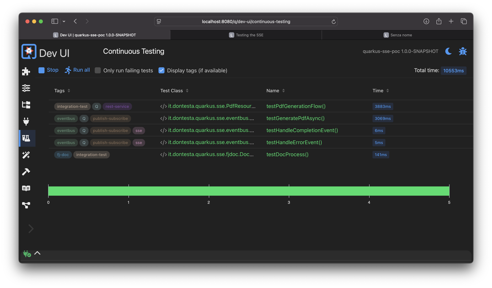

## Cronologia delle revisioni

| Versione | Data       | Autore          | Descrizione delle Modifiche                      |
| :------- | :--------- | :-------------- | :----------------------------------------------- |
| 1.0.0    | 2025-06-21 | Antonio Musarra | Prima release                                    |
| 1.1.0    | 2025-06-22 | Antonio Musarra | Aggiunti i capitoli bonus, immagini e didascalie |


[TOC]

<div style="page-break-after: always; break-after: page;"></div>

## Introduzione

La gestione di task asincroni in un'applicazione web può essere una sfida, specialmente quando si tratta di operazioni che richiedono molto tempo, come la generazione di report o l'elaborazione di file. Una soluzione efficace per notificare lo stato di tali operazioni ai client è l'uso dei **Server-Sent Events (SSE)**. Questi eventi consentono al server di inviare aggiornamenti in tempo reale a un client, migliorando l'esperienza utente e la reattività dell'applicazione.

In questo articolo, analizzeremo un'applicazione Proof of Concept (PoC) che dimostra come utilizzare i Server-Sent Events (SSE) per notificare a un client lo stato di un processo asincrono di lunga durata, come la generazione di un PDF. Esploreremo l'architettura, il codice sorgente e gli strumenti per testare la soluzione.


> **Bonus**: alla fine dell'articolo, troverai il link al progetto completo su GitHub, che include un'applicazione Quarkus funzionante con SSE e un client HTML per testare la funzionalità. Inoltre, sono inclusi test automatici con JUnit per garantire la qualità del codice e la corretta integrazione tra i componenti + una collection di Postman per testare il flusso end-to-end.


## Cosa sono i Server-Sent Events (SSE)?

I Server-Sent Events sono uno standard web che permette a un server di inviare aggiornamenti a un client in modo proattivo su una singola connessione HTTP. A differenza di WebSockets, la comunicazione è unidirezionale: solo dal server al client. Quali sono i vantaggi principali dei SSE?

- **Semplicità**: SSE si basa su HTTP/1.1 ed è più semplice da implementare sia lato client che server rispetto a WebSockets.
- **Efficienza**: evita l'overhead del polling continuo, dove il client deve chiedere ripetutamente al server se ci sono novità.
- **Standard Web**: è supportato nativamente dalla maggior parte dei browser moderni tramite l'oggetto EventSource.
- **Riconnessione Automatica**: i client SSE gestiscono automaticamente la riconnessione in caso di perdita del collegamento.

In questa PoC, SSE viene utilizzato per informare l'utente sullo stato di una richiesta di generazione di un PDF. Il client avvia la richiesta, riceve un ID e si mette in ascolto su un canale SSE in attesa di ricevere la notifiche di avvenuta generazione del PDF. Questo approccio consente di mantenere l'interfaccia utente reattiva e di evitare il blocco del thread principale durante operazioni potenzialmente lunghe.

<div style="page-break-after: always; break-after: page;"></div>

## Architettura e flusso dell'applicazione

L'architettura dell'applicazione è semplice ma efficace. Il client invia una richiesta al server per avviare la generazione del PDF. Il server risponde con un ID univoco per la richiesta e inizia il processo di generazione in background. Durante questo processo, il server invia aggiornamenti di stato tramite SSE al client, che poi deciderà come usare queste informazioni.

Il flusso dell'applicazione può essere riassunto come segue:


Figura 1: Flusso dell'applicazione con Server-Sent Events

Quali sono i componenti principali di questa architettura?

- **Client**: invia la richiesta di generazione del PDF e si mette in ascolto per gli aggiornamenti.
- **Server**: gestisce la richiesta, avvia il processo di generazione e invia gli aggiornamenti tramite SSE.
- **Processo di generazione**: esegue la logica per generare il PDF in background.
- **SSE**: gestisce la comunicazione degli aggiornamenti di stato dal server al client.
- **Interfaccia utente**: mostra lo stato della generazione del PDF all'utente.

Questa architettura consente di separare le responsabilità, mantenendo il codice pulito e facilmente manutenibile. Il server gestisce la logica di business, mentre il client si occupa della presentazione e dell'interazione con l'utente.

Questa PoC è stata realizzata utilizzando il framework cloud native Quarkus. Quali sono i componenti principali di Quarkus utilizzati in questa PoC?

- **Quarkus REST**: per gestire le richieste HTTP e le risposte usando il modello non bloccante e il supporto per SSE.
- **Quarkus Event Bus**: per gestire la comunicazione asincrona tra i vari componenti dell'applicazione.

<div style="page-break-after: always; break-after: page;"></div>

## Analisi del codice sorgente

Il backend dell'applicazione è custituito da due componenti principali:

1. Endpoint REST per avviare la generazione del PDF e restituire l'ID della richiesta.
2. Endpoint SSE per inviare aggiornamenti di stato al client.
3. Un servizio che gestisce la logica di generazione del PDF e invia gli aggiornamenti di stato usando l'Event Bus di Quarkus.

### Endpoint REST

L'endpoint REST `/generate` è responsabile dell'avvio della generazione del PDF e della restituzione dell'ID della richiesta. A seguire l'implementazione di questo endpoint.

```java
@POST
@Path("/generate")
@Produces(MediaType.TEXT_PLAIN)
public Uni<String> generatePdf() {
    String processId = UUID.randomUUID().toString();
    Log.debugf("Starting the PDF generation for ID: %s", processId);

    // Pubblica una richiesta sull'event bus
    eventBus.publish(
        requestsDestination,
        new PdfGenerationRequest(processId),
        new DeliveryOptions().setCodecName(PdfGenerationRequestCodec.CODEC_NAME));

    Log.debugf("Request for PDF generation for ID %s sent to the event bus.", processId);

    return Uni.createFrom().item(processId);
}
```

Source Code 1: Implementazione dell'endpoint REST per la richiesta di generazione del PDF

Questo è un tipo di operazione non bloccante che restituisce un `Uni<String>`, per essere eseguita sul thread di I/O (event loop), garantendo così prestazioni elevate e scalabilità. Il metodo genera un ID univoco per la richiesta e pubblica un evento sull'Event Bus di Quarkus per avviare il processo di generazione del PDF.


> **Approfondimento**: per saperne di più su Quarkus e il suo Event Bus, consulta la [documentazione ufficiale](https://quarkus.io/guides/reactive-event-bus).
> Per ulteriori approfondimenti sull'Event Bus, consiglio di leggere l'eBook [Quarkus Event Bus - Come sfruttarlo al massimo: utilizzi e vantaggi](https://bit.ly/3VTG2dt).

<div style="page-break-after: always; break-after: page;"></div>

### Endpoint SSE

L'endpoint SSE `/status/{id}` è responsabile dell'invio degli aggiornamenti di stato al client. A seguire l'implementazione di questo endpoint.

```java
@GET
@Path("/status/{processId}")
@Produces(MediaType.SERVER_SENT_EVENTS)
@RestStreamElementType(MediaType.TEXT_PLAIN)
public Multi<String> getPdfStatus(@PathParam("processId") String processId) {
    Log.debugf("The client requested status for ID: %s", processId);

    return Multi.createFrom()
        .emitter(
            emitter -> {
                sseEmitters.put(processId, emitter);
                Log.debugf("SSE emitter stored for ID: %s", processId);

                emitter.onTermination(() -> {
                    sseEmitters.remove(processId);
                    Log.debugf("SSE emitter removed for ID: %s", processId);
                });
            });
}
```

Source Code 2: Implementazione dell'endpoint SSE per gli aggiornamenti di stato del PDF

Questo endpoint utilizza `Multi<String>` per inviare aggiornamenti di stato in tempo reale al client. Quando un client si connette, viene creato un emitter che viene memorizzato in una ConcurrentMap (`sseEmitters`) associata all'ID del processo. Gli aggiornamenti di stato possono essere inviati a questo emitter durante il processo di generazione del PDF.

L'uso dell'annotazione `@Produces(MediaType.SERVER_SENT_EVENTS)` indica che questo endpoint è progettato per gestire Server-Sent Events, permettendo al server di inviare aggiornamenti in tempo reale al client.

L'uso di `@RestStreamElementType(MediaType.TEXT_PLAIN)` consente di specificare il tipo di contenuto degli eventi inviati al client, in questo caso testo semplice.

<div style="page-break-after: always; break-after: page;"></div>

#### Nota sulla Gestione degli Emitter SSE con ConcurrentMap

Nell'implementazione corrente, la mappa `ConcurrentMap<String, MultiEmitter<? super String>>` viene utilizzata per memorizzare le connessioni Server-Sent Events (SSE) attive. Ogni `processId` univoco è associato a un `MultiEmitter`, che rappresenta il canale di comunicazione verso un client specifico.

Questa soluzione è semplice ed efficace per un'applicazione che viene eseguita come singola istanza. La `ConcurrentHashMap` garantisce la gestione sicura della mappa in un ambiente multi-threaded all'interno della stessa JVM.

Tuttavia, questo approccio presenta limiti significativi in un ambiente di produzione distribuito (es. cluster Kubernetes, più istanze dietro un load balancer):

- **Stato Locale**: la mappa risiede nella memoria della singola istanza dell'applicazione. Se l'applicazione viene scalata orizzontalmente, ogni istanza avrà la propria mappa isolata, non condivisa.
- **Problema di Routing**: un client potrebbe stabilire la connessione SSE con l'istanza A, ma l'evento di completamento del PDF potrebbe essere gestito dall'istanza B. L'istanza B non avrebbe alcun riferimento al MultiEmitter del client (che si trova sull'istanza A) e non potrebbe inviare la notifica.
- **Mancanza di Resilienza**: se l'istanza che detiene la connessione si riavvia o va in crash, tutti gli Emitter e le connessioni attive vengono persi.

Per superare questi limiti, la mappa in memoria dovrebbe essere sostituita da un meccanismo di messaggistica Pub/Sub esterno, come Redis Pub/Sub, RabbitMQ o Apache Kafka.

Il flusso modificato sarebbe:

1. Quando un client si connette, l'istanza dell'applicazione crea il MultiEmitter e sottoscrive un canale/topic univoco sul message broker (es. `pdf-status-channel:<processId>`).
2. Quando un worker (su qualsiasi istanza) completa la generazione del PDF, pubblica un messaggio su quel canale specifico nel broker.
3. Il broker distribuisce il messaggio a tutti i sottoscrittori. L'istanza che ha la connessione SSE attiva riceve il messaggio.
4. A questo punto, l'istanza recupera il MultiEmitter corretto (che può ancora tenere in una mappa locale) e invia la notifica al client.

Questo pattern rende le istanze dell'applicazione stateless rispetto alla gestione delle sessioni SSE, permettendo di scalare orizzontalmente in modo affidabile.

<div style="page-break-after: always; break-after: page;"></div>

### Gestione della sottoscrizione e degli aggiornamenti di stato

Sulla classe `PdfResource` (dove sono definiti gli endpoint REST e SSE), è presente un metodo annotato con `@PostConstruct` per gestire la sottoscrizione agli aggiornamenti di stato, e in particolare come consumer per i messaggi e/o eventi pubblicati sull'Event Bus e sulla destinazione `completedDestination`.

```java
@PostConstruct
void init() {
    // Subscribe to the event bus for PDF generation completion events
    consumer = eventBus
        .<PdfGenerationCompleted> consumer(completedDestination)
        .handler(this::handlePdfCompletedEvent);
    }
```

Source Code 3: Sottoscrizione agli eventi di completamento della generazione del PDF

Ogni qualvolta viene ricevuto un evento di completamento della generazione del PDF, il metodo `handlePdfCompletedEvent` viene chiamato per inviare l'aggiornamento di stato al client tramite l'emitter associato all'ID del processo.

```java
// Handler for PDF generation completion events
private void handlePdfCompletedEvent(Message<PdfGenerationCompleted> message) {
    PdfGenerationCompleted completion = message.body();
    Log.debugf("Received PDF completion event for ID: %s, URL: %s",
            completion.processId(), completion.pdfUrl());

    MultiEmitter<? super String> emitter = sseEmitters.get(completion.processId());
    
    if (emitter != null) {
        emitter.emit("PDF_READY:" + completion.pdfUrl());
        emitter.complete();
    } else {
        Log.warnf("No active SSE emitter found for ID: %s", completion.processId());
    }
}
```

Source Code 4: Gestione dell'evento di completamento della generazione del PDF

Questo metodo recupera l'emitter associato all'ID del processo dalla mappa `sseEmitters` e invia un messaggio di stato `PDF_READY` con l'URL del PDF generato. Se l'emitter non è più attivo (ad esempio, se il client si è disconnesso), viene registrato un avviso.

<div style="page-break-after: always; break-after: page;"></div>

## Il servizio di generazione del PDF

Il ruolo di `PdfEventProcessor` è quello di worker asincrono disaccoppiato dall'endpoint REST, che si occupa di generare il PDF (attività che può richiedere del tempo) in background e inviare gli aggiornamenti di stato tramite l'Event Bus.

Questo disaccoppiamento è fondamentale per garantire che l'endpoint REST rimanga reattivo e non blocchi il thread di I/O durante la generazione del PDF.

Vediamo quali sono le principali responsabilità di `PdfEventProcessor`:

- **Gestione del Ciclo di Vita**: utilizza gli eventi di `StartupEvent` e `ShutdownEvent` di Quarkus per gestire le proprie risorse in modo pulito. All'avvio, si sottoscrive all'event bus; allo spegnimento, annulla la sottoscrizione e termina il suo pool di thread.
- **Ascolto delle Richieste**: si registra sull'event bus per consumare i messaggi di tipo `PdfGenerationRequest`.
- **Esecuzione Asincrona**: gestisce un proprio `ScheduledExecutorService` per eseguire la logica di generazione del PDF su un pool di thread separato. Questo è il meccanismo chiave che impedisce di bloccare l'event loop.
- **Notifica del Completamento**: una volta che il task è completato, pubblica un evento `PdfGenerationCompleted` sull'event bus, che verrà poi inoltrato al client corretto tramite la connessione SSE.

Analizziamo il codice di `PdfEventProcessor` vedendo i metodi chiave che implementano questa logica.

Inizializzazione e registrazione del consumer (onStart): all'avvio dell'applicazione, il metodo `onStart` si occupa di registrare il consumer sull'event bus per ricevere le richieste di generazione del PDF.

```java
void onStart(@Observes StartupEvent ev) {
    Log.debug("Initialization of the PdfEventProcessor...");
    consumer = eventBus
            .<PdfGenerationRequest> consumer(requestsDestination)
            .handler(this::handlePdfGenerationRequest);

    Log.debugf(
            "Registered consumer for PDF generation requests on destination: %s", requestsDestination);
}
```

Source Code 5: Registrazione del consumer per le richieste di generazione del PDF

La registrazione del consumer consente a `PdfEventProcessor` di ricevere le richieste di generazione del PDF e di gestirle in modo asincrono.

La gestione della richiesta di generazione del PDF (`handlePdfGenerationRequest`): questo metodo viene chiamato ogni volta che viene ricevuta una richiesta di generazione del PDF. Non esegue direttamente il lavoro, ma lo delega al metodo `generatePdfAsync`. Utilizza un `CompletableFuture` per gestire il risultato in modo asincrono.

```java
private void handlePdfGenerationRequest(Message<PdfGenerationRequest> message) {
    PdfGenerationRequest request = message.body();
    Log.debugf("Received PDF generation request with ID: %s", request.processId());

    // Simula la generazione del PDF in modo asincrono
    generatePdfAsync(request.processId())
            .thenAccept(
                    pdfUrl -> {
                        // Quando il PDF è generato, pubblica un evento di completamento
                        PdfGenerationCompleted completionEvent = new PdfGenerationCompleted(request.processId(), pdfUrl);

                        eventBus.publish(
                                completedDestination,
                                completionEvent,
                                new DeliveryOptions().setCodecName(PdfGenerationCompletedCodec.CODEC_NAME));
                        Log.debugf("PDF completion notification sent for ID: %s", request.processId());
                    });
}
```

Source Code 6: Gestione della richiesta di generazione del PDF

Il metodo `generatePdfAsync` esegue "il lavoro pesante". Utilizza lo `ScheduledExecutorService` per pianificare l'esecuzione del task dopo un ritardo casuale. Al termine, completa il `CompletableFuture` con l'URL del PDF generato.

```java
private CompletableFuture<String> generatePdfAsync(String processId) {
    CompletableFuture<String> future = new CompletableFuture<>();

    long delayInSeconds = ThreadLocalRandom.current().nextLong(minDelayInSeconds, maxDelayInSeconds);

    // Simula un ritardo usando un executor dedicato
    executor.schedule(
            () -> {
                // URL del PDF generato
                String pdfUrl = "https://storage.example.com/pdfs/" + processId + ".pdf";
                Log.debugf("PDF successfully generated: %s", pdfUrl);
                future.complete(pdfUrl);
            },
            delayInSeconds,
            TimeUnit.SECONDS);

    return future;
}
```

Source Code 7: Generazione asincrona del PDF

Questo approccio consente di eseguire la generazione del PDF in modo asincrono, senza bloccare il thread di I/O, e di notificare il completamento tramite l'Event Bus.


> **Nota**: sull'implementazione del `PdfEventProcessor` si è scelto di non utilizzare l'annotazione `@ConsumeEvent` per la registrazione del consumer sull'event bus, preferendo un approccio programmatico. Il motivo di questa scelta è avere un controllo esplicito e granulare sul ciclo di vita del consumer oltre a rendere configurabili i nomi delle destinazioni degli eventi. Questo approccio consente una maggiore flessibilità e facilita la gestione di più destinazioni o tipi di eventi in futuro.

<div style="page-break-after: always; break-after: page;"></div>

## Test dell'applicazione con JUnit e client HTML

Per garantire la qualità e l'affidabilità dell'applicazione, sono stati implementati test automatici utilizzando JUnit e il framework di test di Quarkus. Questi test verificano il corretto funzionamento degli endpoint REST e SSE, assicurando che l'applicazione risponda come previsto durante la generazione del PDF.

All'interno della cartella `src/test/java` due test sono stati implementati per verificare il corretto funzionamento dell'applicazione.

- `PdfGenerationServiceTest`: il test verifica che il servizio di generazione del PDF funzioni correttamente, simulando una richiesta di generazione e verificando che l'URL del PDF generato sia corretto.
- `PdfResourceIntegrationTest`: il test verifica l'integrazione tra gli endpoint REST e SSE, assicurandosi che il client possa ricevere correttamente gli aggiornamenti di stato durante la generazione del PDF.

Entrambi i test utilizzano il framework di test di Quarkus e le librerie JUnit per verificare il comportamento dell'applicazione in modo affidabile.

A seguire lo screenshot della DevUI di Quarkus che mostra i test JUnit eseguiti con successo.



Figura 2: Quarkus DevUI - Test JUnit eseguiti con successo

Il progetto include anche una semplice pagina HTML per testare l'applicazione in modo manuale. Questa pagina consente di inviare una richiesta di generazione del PDF e di visualizzare gli aggiornamenti di stato in tempo reale.

Il file `src/main/resources/templates/pub/pdf-generator.html` contiene il codice JavaScript per interagire con il backend.

1. Click sul bottone "Generate PDF": viene inviata una richiesta POST a `/api/pdf/generate`.
2. Ricezione del processId: una volta ottenuto l'ID, il client lo usa per costruire l'URL dell'endpoint SSE.
3. Creazione dell'EventSource: viene istanziato un nuovo oggetto EventSource che apre una connessione persistente a `/api/pdf/status/{processId}`.
4. Gestione degli eventi:
   - `eventSource.onmessage`: questo handler viene invocato ogni volta che il server invia un messaggio. Il contenuto del messaggio viene aggiunto a una textarea.
   - Se il messaggio indica che il PDF è pronto (`PDF_READY:`), viene mostrato il link per il download, la connessione SSE viene chiusa (eventSource.close()) e il bottone viene riattivato.
   - `eventSource.onerror`: gestisce eventuali errori di connessione.

```javascript
// ...
.then(processId => {
    appendToLog(`Request sent successfully. Process ID: ${processId}`);
    
    // Crea una nuova connessione SSE
    eventSource = new EventSource(`/api/pdf/status/${processId}`);

    eventSource.onmessage = function(event) {
        const data = event.data;
        appendToLog(`Received event: ${data}`);

        if (data.startsWith('PDF_READY:')) {
            // ... mostra il link e chiude la connessione
            eventSource.close();
        }
    };
    // ...
});
```

Source Code 8: Gestione degli eventi SSE nel client HTML

A seguire uno screenshot della pagina HTML in esecuzione, che mostra il flusso di generazione del PDF e la ricezione degli aggiornamenti di stato tramite SSE.


Figura 3: Client HTML - Generazione PDF con SSE

Dai log della console dell'applicazione, possiamo vedere il flusso di esecuzione mostrato nel sequence diagram di Figura 1. A seguire un esempio di log generato a fronte della richiesta di generazione del PDF eseguita dal client HTML.

```plaintext
2025-06-22 10:55:18,944 DEBUG [it.don.qua.sse.ws.rs.PdfResource] (vert.x-eventloop-thread-1) Starting the PDF generation for ID: b1e238e6-1e0f-4e2f-bc1a-7f1b108a52ad
2025-06-22 10:55:18,947 DEBUG [it.don.qua.sse.ws.rs.PdfResource] (vert.x-eventloop-thread-1) Request the PDF generation for ID b1e238e6-1e0f-4e2f-bc1a-7f1b108a52ad sent to the event bus.
2025-06-22 10:55:18,952 DEBUG [it.don.qua.sse.eve.pro.pdf.PdfEventProcessor] (vert.x-eventloop-thread-0) Received PDF generation request with ID: b1e238e6-1e0f-4e2f-bc1a-7f1b108a52ad
2025-06-22 10:55:18,956 DEBUG [it.don.qua.sse.ws.rs.PdfResource] (vert.x-eventloop-thread-1) The client requested status for ID: b1e238e6-1e0f-4e2f-bc1a-7f1b108a52ad
2025-06-22 10:55:18,958 DEBUG [it.don.qua.sse.ws.rs.PdfResource] (vert.x-eventloop-thread-1) SSE emitter stored for ID: b1e238e6-1e0f-4e2f-bc1a-7f1b108a52ad
2025-06-22 10:55:27,954 DEBUG [it.don.qua.sse.eve.pro.pdf.PdfEventProcessor] (pool-8-thread-1) PDF successfully generated: https://storage.example.com/pdfs/b1e238e6-1e0f-4e2f-bc1a-7f1b108a52ad.pdf
2025-06-22 10:55:27,958 DEBUG [it.don.qua.sse.eve.pro.pdf.PdfEventProcessor] (pool-8-thread-1) Attempting to send PDF completion notification for ID: b1e238e6-1e0f-4e2f-bc1a-7f1b108a52ad
2025-06-22 10:55:27,959 DEBUG [it.don.qua.sse.eve.pro.pdf.PdfEventProcessor] (pool-8-thread-1) PDF completion notification sent for ID: b1e238e6-1e0f-4e2f-bc1a-7f1b108a52ad
2025-06-22 10:55:27,961 DEBUG [it.don.qua.sse.ws.rs.PdfResource] (vert.x-eventloop-thread-1) Received PDF completion event for ID: b1e238e6-1e0f-4e2f-bc1a-7f1b108a52ad, URL: https://storage.example.com/pdfs/b1e238e6-1e0f-4e2f-bc1a-7f1b108a52ad.pdf
2025-06-22 10:55:27,967 DEBUG [it.don.qua.sse.ws.rs.PdfResource] (vert.x-eventloop-thread-1) SSE emitter removed for ID: b1e238e6-1e0f-4e2f-bc1a-7f1b108a52ad
```

Console 1: Log generato durante la generazione del PDF

Dal log è anche possibile notare l'uso dell'event loop di Vert.x (`vert.x-eventloop-thread-1`), che gestisce le richieste in modo non bloccante e asincrono; oltre al thread del pool dedicato per l'esecuzione della generazione del PDF (`pool-8-thread-1`).

<div style="page-break-after: always; break-after: page;"></div>

## Test dell'applicazione con Postman

All'interno di questa PoC, è stata inclusa una collection di Postman nel file `src/main/postman/collection/postman_collection.json`. Questa collection permette di testare facilmente il flusso end-to-end.

La collection contiene due richieste da eseguire in sequenza:

1. Generate PDF
    - Azione: esegue una richiesta POST all'endpoint `/api/pdf/generate`.
    - Scopo: avvia il processo di generazione asincrona del PDF. Il server risponde immediatamente con un ID di processo univoco (UUID).
    - Automazione: lo script nella tab "Tests" di questa richiesta cattura automaticamente l'ID di processo dalla risposta e lo salva in una variabile di collezione (processId) per utilizzarlo nel passo successivo.
2. Get PDF Status (SSE)
    - Azione: esegue una richiesta GET all'endpoint `/api/pdf/status/{{processId}}`.
    - Scopo: utilizza l'ID salvato in precedenza per aprire una connessione Server-Sent Events e mettersi in ascolto degli aggiornamenti di stato.
    - Risultato Atteso: Postman manterrà la connessione aperta. Dopo il ritardo simulato dal `PdfEventProcessor`, il server invierà un evento. Postman visualizzerà la notifica ricevuta, che sarà simile a:
      data: PDF_READY: <https://storage.example.com/pdfs/xxxxxxxx-xxxx-xxxx-xxxx-xxxxxxxxxxxx.pdf>
    - Automazione: gli script di test associati verificano che la risposta contenga l'evento `PDF_READY` e che l'URL fornito sia sintatticamente valido.

Eseguendo queste due richieste in ordine, è possibile testare l'intero flusso: avvio del task, ricezione dell'ID, sottoscrizione agli eventi e ricezione della notifica di completamento tramite SSE.

La figura seguente mostra la collection di Postman in esecuzione, con i risultati dei test che confermano il corretto funzionamento dell'applicazione.


Figura 4: Postman Collection - Test SSE

<div style="page-break-after: always; break-after: page;"></div>

## Conclusioni

Questa PoC dimostra perfettamente come Quarkus e la sua integrazione con Mutiny e Vert.x semplifichino l’implementazione di flussi event-driven con feedback in tempo reale tramite SSE. Un’ottima soluzione per scenari in cui si desidera notificare l’utente al completamento di processi asincroni senza ricorrere a polling inefficiente o WebSocket troppo complessi.

L'uso di SSE in combinazione con l'Event Bus di Quarkus consente di costruire applicazioni scalabili e reattive, migliorando l'esperienza utente e la manutenibilità del codice. La separazione delle responsabilità tra il server e il client, insieme alla gestione asincrona dei task, rende questa architettura ideale per applicazioni moderne che richiedono interazioni in tempo reale.

In questa PoC è stato gestito un solo evento di completamento della generazione del PDF, ma il modello può essere facilmente esteso per gestire più eventi o stati, come errori durante la generazione, progressi intermedi, ecc. Inoltre, l'uso di un message broker esterno per la gestione degli emitter SSE renderebbe l'architettura ancora più robusta e scalabile in ambienti distribuiti.


## Bonus: codice sorgente completo su GitHub

Il codice sorgente completo della PoC è disponibile su GitHub, dove puoi esplorare l'implementazione dettagliata e testare l'applicazione direttamente nel tuo ambiente. L'indirizzo del repository è [https://github.com/amusarra/quarkus-sse-poc]. Non dimenticare di mettere una stella al progetto se lo trovi utile!


## Bonus: Un framework per la generazione di documenti

Nella nostra PoC, la generazione del PDF è simulata con un semplice ritardo temporale per concentrarci sul meccanismo SSE. Tuttavia, in un'applicazione reale, avresti bisogno di una libreria robusta per creare effettivamente i documenti.

Un'ottima scelta nel mondo Java è **fj-doc** ([https://github.com/fugerit-org/fj-doc](https://github.com/fugerit-org/fj-doc)). Si tratta di un framework open-source progettato da [Matteo Franci](https://www.linkedin.com/in/matteo-franci/) per semplificare la generazione di documenti in vari formati, tra cui:

- PDF
- HTML
- XML
- XLS/XLSX
- CSV

**fj-doc** è estremamente flessibile e permette di definire la struttura del documento in formato XML, per poi generare l'output desiderato. Supporta anche l'uso di template engine come Freemarker, rendendo dinamica la creazione dei contenuti.

Potresti integrare `fj-doc` all'interno del metodo `generatePdfAsync` della classe `PdfEventProcessor` per sostituire la simulazione con una logica di generazione reale, creando così un flusso di lavoro completo e funzionale.


## Risorse Utili

- [Quarkus Official Documentation](https://quarkus.io/guides/)
- [Server-Sent Events - MDN Web Docs](https://developer.mozilla.org/en-US/docs/Web/API/Server-sent_events)
- [Quarkus Event Bus Guide](https://quarkus.io/guides/reactive-event-bus)
- [Quarkus SSE Guide](https://quarkus.io/guides/rest#server-sent-event-sse-support)
- [Quarkus Event Bus - Come sfruttarlo al massimo: utilizzi e vantaggi](https://bit.ly/3VTG2dt)
- [Quarkus Event Bus Logging Filter JAX-RS](https://github.com/amusarra/eventbus-logging-filter-jaxrs)